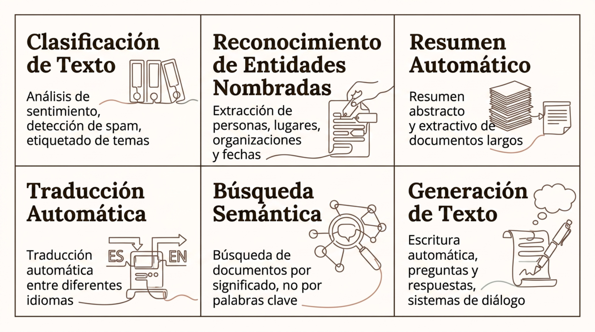

# Aplicaciones sectoriales

> Módulo 1 · Introducción a la Inteligencia Artificial

**Navegación:** [Índice general](../README.md) · [Índice del módulo](../README.md#modulo-1) · ⟵ [Anterior: IA Generativa y LLM](03-ia-generativa-y-llm.md) · [Siguiente: Riesgos y regulación →](05-riesgos-y-regulacion.md)

### Computer Vision

Computer Vision es la rama de la IA que convierte imágenes y vídeo en información estructurada y accionable. Sus aplicaciones van desde el control de calidad industrial hasta la conducción autónoma.

- **Clasificación**: asigna una categoría a toda la imagen. Ej.: tumor/no tumor en radiología.
- **Detección de objetos**: localiza e identifica múltiples objetos con bounding boxes. Ej.: sistemas de vigilancia, automoción.
- **Segmentación**: clasifica cada píxel de la imagen. Ej.: análisis de imágenes médicas, conducción autónoma.
- **OCR / Tracking**: extracción de texto en imágenes y seguimiento de objetos en vídeo en tiempo real.

---

### Procesamiento del lenguaje natural

NLP (Natural Language Processing) abarca las técnicas para que las máquinas comprendan, analicen, transformen y generen lenguaje humano en cualquiera de sus formas.

- **Clasificación de Texto**: análisis de sentimiento, detección de spam, etiquetado de temas.
- **Reconocimiento de Entidades Nombradas**: extracción de personas, lugares, organizaciones y fechas.
- **Resumen Automático**: resumen abstracto y extractivo de documentos largos.
- **Traducción Automática**: traducción automática entre diferentes idiomas.
- **Búsqueda Semántica**: búsqueda de documentos por significado, no por palabras clave.
- **Generación de Texto**: escritura automática, preguntas y respuestas, sistemas de diálogo.

---

### Robótica e IA física

La IA física integra percepción, razonamiento y actuación en sistemas que operan en el mundo real. Los robots modernos combinan visión, planificación y control en bucles de retroalimentación continua. El ciclo de funcionamiento sigue las etapas:

- Percepción
- Estimación
- Planificación
- Control
- Acción

**Aplicaciones actuales**
- Robótica industrial: ensamblaje, soldadura, paletizado.
- Logística: picking, clasificación, almacenes autónomos.
- Robótica quirúrgica asistida.

**Desafíos específicos**
- Operación en entornos no estructurados y cambiantes.
- Seguridad física en coexistencia con humanos.
- Latencia de inferencia en tiempo real.

---

### Automatización inteligente

La IA puede asistir o automatizar componentes de workflows empresariales que antes requerían intervención humana constante, mejorando velocidad, consistencia y escalabilidad.

- **Captura**: OCR e ingesta automática de documentos, formularios, facturas y correos electrónicos.
- **Clasificación**: categorización automática de solicitudes, tickets, documentos y transacciones según su tipo.
- **Extracción**: identificación y estructuración de entidades clave: importes, fechas, cláusulas, códigos.
- **Decisión / Acción**: copilots que asisten al agente humano o agentes que ejecutan acciones dentro de límites definidos.

---

### IA en salud

La IA puede apoyar diagnóstico, investigación y operaciones clínicas, pero opera bajo estrictos requisitos de validación clínica, privacidad (HIPAA, RGPD) y supervisión médica.

- **Imagen médica**: detección de tumores, fracturas o retinopatía en radiología, patología digital y oftalmología.
- **Predicción de riesgo**: modelos de estratificación de pacientes por riesgo de reingreso, deterioro clínico o mortalidad.
- **Genómica y descubrimiento**: AlphaFold (predicción de estructura proteica) y modelos para identificación de candidatos farmacológicos.
- **Documentación clínica**: transcripción automática de consultas, generación de notas clínicas estructuradas y codificación diagnóstica.

---

### IA en finanzas

El sector financiero fue pionero en la adopción de ML. Hoy combina modelos clásicos de riesgo con capacidades de GenAI para operaciones, atención y cumplimiento normativo.

**Gestión de riesgo y fraude**
- Detección de fraude: análisis en tiempo real de transacciones anómalas.
- AML (Anti-Money Laundering): grafos de transacciones y detección de patrones sospechosos.
- Credit scoring: modelos de predicción de impago más granulares que las reglas tradicionales.
- Forecasting: predicción de demanda de liquidez, series temporales de mercado.

**Operaciones y atención**
- Asistentes conversacionales: atención al cliente, gestión de consultas y resolución de incidencias.
- Automatización documental: procesamiento de contratos, KYC y reporting regulatorio.

---

### IA en industria

La convergencia de IoT, sensórica industrial y modelos de ML crea fábricas más eficientes y resilientes, capaces de anticipar fallos y optimizar producción en tiempo real.

- **Mantenimiento predictivo**: sensores de vibración, temperatura y corriente alimentan modelos que predicen fallos antes de que ocurran, reduciendo tiempos de parada no planificados.
- **Inspección visual**: visión artificial detecta defectos de fabricación con mayor velocidad y consistencia que la inspección manual.
- **Planificación y scheduling**: optimización de secuencias de producción, gestión de inventario y asignación de recursos mediante modelos de optimización.
- **Control de proceso**: RL y modelos de control ajustan parámetros de proceso en tiempo real para maximizar rendimiento y calidad.

---

### IA en retail y marketing

Los datos de comportamiento del cliente (navegación, compra, interacción) permiten personalización a escala, optimización de inventario y campañas más eficientes.

- **Recomendación personalizada**: motores de recomendación basados en filtrado colaborativo y embeddings de usuario-producto. Ej.: Amazon, Netflix, Spotify.
- **Predicción de churn**: modelos que identifican clientes con alta probabilidad de abandono para activar retención proactiva.
- **Previsión de demanda**: series temporales y modelos de ML para optimizar inventario, reducir roturas de stock y ajustar precios dinámicamente.
- **Optimización de campañas**: segmentación, personalización de contenido y optimización de puja publicitaria mediante modelos de propensión.
