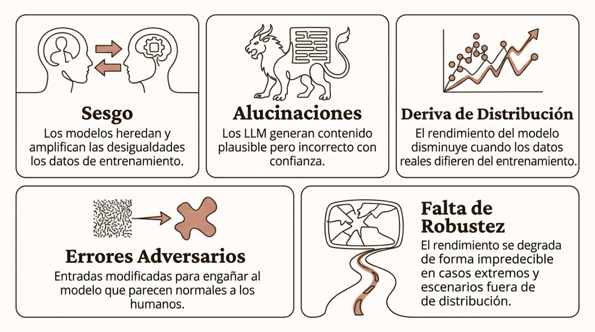
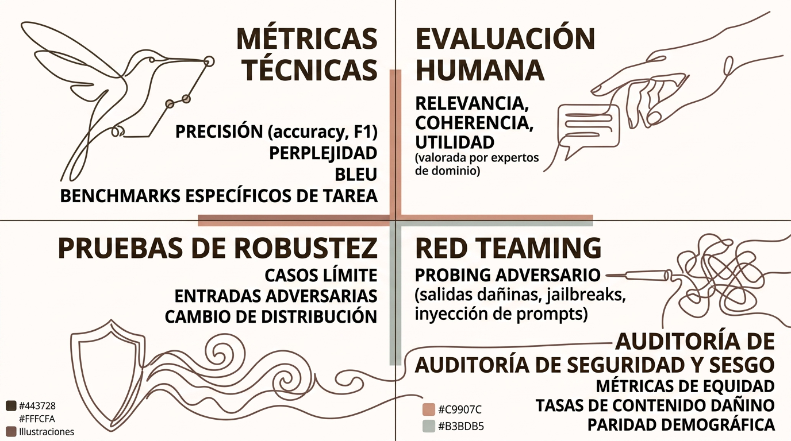

# Riesgos y regulación

> Módulo 1 · Introducción a la Inteligencia Artificial
>
> **Práctica relacionada:** [Laboratorio 1.4 — Auditoría de sesgo y riesgo de un caso real](../Labs/01-introduccion-a-la-ia/lab-1.4-auditoria-sesgo/enunciado.md)

**Navegación:** [Índice general](../README.md) · [Índice del módulo](../README.md#modulo-1) · ⟵ [Anterior: Aplicaciones sectoriales](04-aplicaciones-sectoriales.md) · [Siguiente: Tendencias 2026 →](06-tendencias-2026.md)

### Limitaciones de la IA

Conocer los límites técnicos de los sistemas de IA es esencial para diseñar aplicaciones seguras y establecer expectativas realistas sobre su fiabilidad en producción.

- **Sesgo**: los modelos heredan y amplifican las desigualdades de los datos de entrenamiento.
- **Alucinaciones**: los LLM generan contenido plausible pero incorrecto con confianza.
- **Deriva de Distribución**: el rendimiento del modelo disminuye cuando los datos reales difieren del entrenamiento.
- **Errores Adversarios**: entradas modificadas para engañar al modelo que parecen normales a los humanos.
- **Falta de Robustez**: el rendimiento se degrada de forma impredecible en casos extremos y escenarios fuera de distribución.

Ningún sistema de IA es 100% fiable. El diseño debe incluir mecanismos de detección de fallos, escalado humano y monitorización continua.

---

### Sesgo y fairness

El sesgo algorítmico (algorithmic bias) surge cuando los datos, etiquetas o decisiones de diseño producen resultados sistemáticamente desiguales para distintos grupos de personas. El sesgo puede introducirse en cualquiera de las siguientes etapas: **Recolección → Etiquetado → Selección → Entrenamiento**.

**Tipos de sesgo**
- Sesgo de muestreo: datos de entrenamiento no representativos.
- Sesgo de etiquetado: etiquetas históricas reflejan decisiones discriminatorias.
- Variables proxy: features correladas con atributos protegidos (género, etnia).

**Fairness**

No existe una única definición de equidad: hay más de 20 métricas de fairness matemáticamente incompatibles entre sí. La elección depende del contexto ético y legal del caso de uso.

---

### Privacidad y seguridad de IA

Los sistemas de IA introducen nuevas superficies de ataque y riesgos de privacidad que deben gestionarse específicamente, más allá de la seguridad IT convencional.

- **Privacidad de datos**: los modelos pueden memorizar información de entrenamiento. Técnicas como differential privacy y federated learning mitigan el riesgo de exposición de datos sensibles.
- **Prompt Injection**: ataques que insertan instrucciones maliciosas en el contexto del modelo para manipular su comportamiento o extraer información confidencial del system prompt.
- **Data / Model Exfiltration**: ataques de extracción que intentan reconstruir datos de entrenamiento o robar los pesos del modelo mediante consultas sistemáticas (model stealing).
- **Uso indebido**: generación de desinformación, deepfakes, phishing personalizado y código malicioso mediante modelos generativos sin salvaguardas adecuadas.

---

### Explicabilidad y supervisión humana

En sistemas de alto impacto —crédito, justicia, medicina, contratación—, las personas afectadas y los responsables de decisiones necesitan entender cómo y por qué un sistema llega a sus conclusiones.

**Dimensiones de la explicabilidad**
- Interpretabilidad: el modelo es comprensible por diseño (ej.: árbol de decisión).
- Explicabilidad post-hoc: técnicas como SHAP o LIME explican modelos opacos.
- Trazabilidad: registro de qué datos, versión y configuración produjo cada predicción.

**Human-in-the-loop**

El nivel de autonomía del sistema debe calibrarse según el riesgo de la decisión:
- Human-in-the-loop: humano aprueba cada decisión del sistema.
- Human-on-the-loop: sistema actúa autónomamente, humano monitoriza y puede intervenir.
- Human-out-of-the-loop: sistema completamente autónomo (requiere validación exhaustiva).

---

### Evaluación de sistemas de IA

Evaluar un sistema de IA moderno va mucho más allá de medir precisión en un conjunto de test. Requiere dimensiones técnicas, de seguridad y de utilidad real en contexto.

- **Métricas técnicas**: precisión (accuracy, F1), perplejidad, BLEU, benchmarks específicos de tarea.
- **Evaluación humana**: relevancia, coherencia, utilidad (valorada por expertos de dominio).
- **Pruebas de robustez**: casos límite, entradas adversarias, cambio de distribución.
- **Red Teaming**: probing adversario (salidas dañinas, jailbreaks, inyección de prompts).
- **Auditoría de seguridad y sesgo**: métricas de equidad, tasas de contenido dañino, paridad demográfica.

Los benchmarks públicos pueden saturarse rápidamente. La evaluación en tareas reales del dominio (domain-specific evaluation) es más predictiva del rendimiento en producción.

---

### IA responsable y NIST AI RMF

El NIST AI Risk Management Framework proporciona un marco estructurado para identificar, evaluar y gestionar los riesgos de los sistemas de IA a lo largo de todo su ciclo de vida.

- **Govern**: establecer cultura, políticas, roles y responsabilidades de gestión del riesgo de IA en la organización.
- **Map**: identificar el contexto, los stakeholders y los riesgos potenciales de un sistema de IA concreto.
- **Manage**: implementar controles, monitorizar y responder ante incidentes durante la operación del sistema.
- **Measure**: cuantificar y priorizar los riesgos identificados mediante métricas y procesos de evaluación.

---

### AI Act europeo: enfoque basado en riesgo

El Reglamento de IA de la UE (AI Act) establece un marco de obligaciones proporcionales al nivel de riesgo que representa cada sistema, con el objetivo de proteger derechos fundamentales sin frenar la innovación.

1. **Prácticas prohibidas**: sistemas de puntuación social, manipulación subliminal, reconocimiento biométrico en tiempo real en espacio público (con excepciones).
2. **Alto riesgo**: infraestructura crítica, educación, empleo, servicios esenciales, justicia. Requisitos estrictos: evaluación de conformidad, registro, transparencia.
3. **Transparencia**: chatbots y sistemas de generación de contenido deben declarar su naturaleza artificial.
4. **Riesgo mínimo**: mayoría de aplicaciones de IA. Cumplimiento voluntario de códigos de buenas prácticas.

---

### AI Act en 2026: calendario conceptual

La aplicación del AI Act es progresiva. En 2026 coexisten obligaciones ya vigentes con disposiciones en período transitorio, lo que exige seguimiento continuo del calendario regulatorio.

- **Ago 2024**: entrada en vigor del Reglamento.
- **Feb 2025**: prohibición de prácticas inaceptables aplicable.
- **Ago 2025**: obligaciones para modelos GPAI (uso general) y gobernanza institucional.
- **Ago 2026** (prorrogado a Dic 2027 por el Digital Omnibus on AI): obligaciones para sistemas de alto riesgo (Anexo III). Alfabetización en IA en las organizaciones.
- **2027-2028**: períodos transitorios para sistemas existentes y sectores con regulación sectorial previa.

Las fechas de aplicación pueden ser objeto de ajustes regulatorios. Consultar siempre las fuentes oficiales de la Comisión Europea.

---

### IA y propiedad intelectual

El uso de datos y contenidos en sistemas de IA plantea cuestiones jurídicas no resueltas sobre copyright, licencias y atribución que afectan tanto al entrenamiento como a los outputs generados.

**Dimensiones clave**
- Training data: ¿está permitido entrenar modelos con contenido protegido por copyright? Litigios activos en múltiples jurisdicciones.
- Outputs: ¿quién es el autor de un texto o imagen generado por IA? La ley varía según el país.
- Licencias: los modelos open source tienen licencias diversas que condicionan su uso comercial.
- Provenance (trazabilidad): necesidad de registrar el origen de los datos y modelos usados en cada sistema.

**Implicaciones prácticas**

Las organizaciones deben revisar los términos de uso de los modelos que despliegan, documentar la procedencia de los datos de entrenamiento y establecer políticas claras sobre qué uso se da a los contenidos generados con IA, especialmente en sectores regulados o con alta exposición legal.
