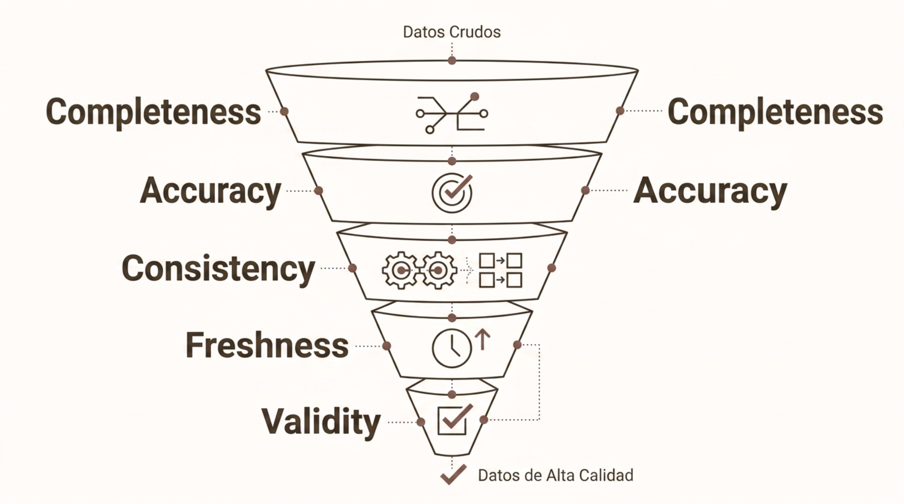

# Las 5 Vs del Big Data

> Módulo 2 · Fundamentos del Big Data
>
> **Práctica relacionada:** [Laboratorio 2.1 — Diagnóstico de las 5 Vs en un dataset real](../Labs/02-fundamentos-del-big-data/lab-2.1-diagnostico-5vs/enunciado.md)

**Navegación:** [Índice general](../README.md) · [Índice del módulo](../README.md#modulo-2) · ⟵ [Anterior: Introducción y objetivos](00-introduccion-y-objetivos.md) · [Siguiente: Fuentes y tipos de datos →](02-fuentes-y-tipos-de-datos.md)

### ¿Por qué surge el Big Data?

La digitalización masiva genera un torrente continuo de datos procedentes de fuentes muy diversas. Cada interacción digital, cada sensor conectado, cada transacción o evento de sistema produce información que debe ser capturada, almacenada y analizada.

- **IoT y sensores** — Millones de dispositivos emiten métricas en tiempo real: temperatura, vibración, consumo energético.
- **Logs y eventos** — Aplicaciones, servidores y redes generan trazas continuas de actividad y errores.
- **Transacciones** — Pagos, pedidos y operaciones financieras producen registros estructurados de alto volumen.
- **Multimedia** — Imágenes, vídeos y audio generados por usuarios y sistemas representan la mayor parte del volumen total de datos.

---

### ¿Qué es Big Data?

Big Data describe tanto los conjuntos de datos como los problemas de gestión que requieren enfoques más escalables o complejos que los sistemas relacionales tradicionales. No es solo una cuestión de tamaño: también implica velocidad de llegada, heterogeneidad de formatos y complejidad de procesamiento.

| | Análisis tradicional | Big Data |
| --- | --- | --- |
| Datos | Datos relacionales y estructurados | Estructurado, semiestructurado y no estructurado |
| Escala | GB o pocos TB | TB, PB e incluso EB |
| Infraestructura | Un único servidor o clúster pequeño | Clústeres distribuidos o cloud elástico |
| Esquema | Esquema fijo y conocido a priori | Schema-on-read y formatos flexibles |
| Procesamiento | Procesamiento batch periódico | Batch, micro-batch y streaming continuo |

---

### Las 5 Vs del Big Data

El marco de las 5 Vs describe dimensiones complementarias que caracterizan los desafíos del Big Data. Ninguna V actúa de forma aislada: una plataforma robusta debe abordarlas todas de manera integrada.

- **Volumen** — Cantidad masiva de datos que supera la capacidad de sistemas convencionales.
- **Velocidad** — Ritmo de generación y necesidad de procesamiento con latencias adecuadas.
- **Variedad** — Heterogeneidad de formatos: tablas, JSON, imágenes, audio, eventos.
- **Veracidad** — Confianza en la calidad, completitud y consistencia de los datos.
- **Valor** — Capacidad de transformar datos en decisiones e impacto de negocio.

---

### Volumen: la escala de los datos

El volumen se refiere a la cantidad absoluta de datos que una organización necesita almacenar y procesar. Cuando los datos superan la capacidad de una sola máquina, se recurre a almacenamiento y procesamiento distribuido (scale-out).

**Conceptos clave**

- Particionado: dividir datos en fragmentos manejables.
- Scale-out: añadir nodos al clúster en lugar de mejorar uno solo.
- Replicación: copias redundantes para disponibilidad.
- Compresión: reducir footprint sin perder información.

**Progresión de escala**

- **GB → TB** — Bases de datos relacionales convencionales, un servidor o réplicas.
- **TB → PB** — Almacenamiento distribuido, particionado horizontal y clústeres.
- **PB → EB** — Object storage cloud con replicación global y gestión de lifecycle.

---

### Velocidad: datos en movimiento

La velocidad describe el ritmo al que se generan y deben procesarse los datos. No todos los casos de uso requieren la misma latencia, por lo que existen distintos patrones de procesamiento según la urgencia de la respuesta.

- Batch
- Micro-batch
- Streaming
- Low-latency

La elección del patrón adecuado impacta directamente en coste, complejidad arquitectónica y frescura de los datos disponibles para el análisis.

---

### Variedad: heterogeneidad de formatos

Las plataformas Big Data deben gestionar datos de naturaleza muy distinta. Comprender la estructura de cada tipo es fundamental para elegir el formato de almacenamiento y el motor de procesamiento adecuados.

**Estructurados**
- Tablas relacionales (SQL)
- Esquema fijo y tipado
- Fácil consulta y agregación
- Ejemplos: ERP, CRM, transacciones

**Semiestructurados**
- JSON, XML, Avro, Parquet
- Estructura flexible, campos opcionales
- Esquema inferido o declarado
- Ejemplos: APIs, logs, eventos de aplicación

**No estructurados**
- Texto libre, imágenes, audio, vídeo
- Sin esquema tabular nativo
- Requieren procesamiento específico (NLP, CV)
- Ejemplos: emails, grabaciones, documentos

---

### Veracidad: la calidad de los datos

La veracidad determina en qué medida se puede confiar en los datos para tomar decisiones. Un modelo entrenado con datos de baja calidad producirá resultados poco fiables, independientemente de su sofisticación técnica.

El diagrama es un embudo visual que representa el proceso de depuración de los datos, desde los **Datos Crudos** en la parte superior hasta los **Datos de Alta Calidad** en la parte inferior, pasando por cinco filtros sucesivos:

- **Completeness** — completitud de los datos.
- **Accuracy** — exactitud de los datos.
- **Consistency** — consistencia de los datos.
- **Freshness** — frescura/actualidad de los datos.
- **Validity** — validez de los datos.

La veracidad no es un estado final, sino un **proceso continuo** de medición, validación y corrección a lo largo de todo el pipeline de datos.

---

### Valor: del dato a la decisión

El objetivo último de cualquier plataforma Big Data no es almacenar datos, sino generar valor de negocio. Los datos son la materia prima; el valor emerge al transformarlos en acciones concretas.

- **Datos brutos** — Materia prima sin procesar.
- **Información** — Datos estructurados y limpios.
- **Insight** — Análisis que revela patrones.
- **Decisión** — Elección basada en evidencia.
- **Acción** — Implementación para negocio.

Sin una cadena clara de datos a acción, el Big Data es solo coste de infraestructura sin retorno.

---

### Variabilidad y otras dimensiones

En algunos contextos el modelo de las 5 Vs se amplía para capturar comportamientos adicionales de los datos que son relevantes en escenarios concretos.

- **Variabilidad** — El significado de un dato puede cambiar según el contexto. Un mismo campo puede interpretarse de forma diferente en distintos sistemas o momentos.
- **Volatilidad** — Define durante cuánto tiempo los datos son válidos y útiles antes de perder relevancia o deber ser eliminados.
- **Validity** — Los datos deben cumplir reglas de negocio y formatos esperados para poder ser utilizados en análisis o modelos.
- **Visualización** — Algunos autores añaden la capacidad de representar e interpretar los datos de forma comprensible como dimensión clave.

Estas extensiones no reemplazan las 5 Vs originales; las complementan según la naturaleza del problema y el sector de aplicación.
