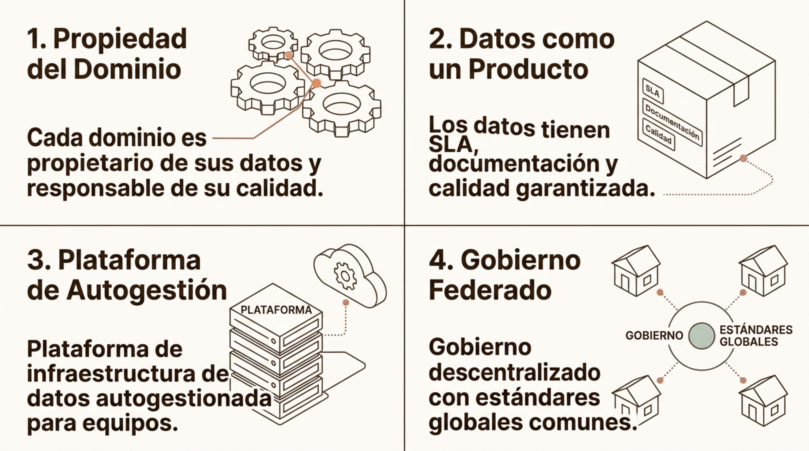

# Arquitectura Big Data

> Módulo 2 · Fundamentos del Big Data
>
> **Práctica relacionada:** [Laboratorio 2.2 — De CSV a Data Lake: diseña la arquitectura](../Labs/02-fundamentos-del-big-data/lab-2.2-arquitectura-data-lake/enunciado.md)

**Navegación:** [Índice general](../README.md) · [Índice del módulo](../README.md#modulo-2) · ⟵ [Anterior: Fuentes y tipos de datos](02-fuentes-y-tipos-de-datos.md) · [Siguiente: Procesamiento — fundamentos y Hadoop →](04a-procesamiento-fundamentos-y-hadoop.md)

### Arquitectura Big Data end-to-end

Una plataforma Big Data moderna integra capas funcionales especializadas que transforman datos brutos en información consumible por personas y sistemas.

- **Sources** — Fuentes de datos: logs, sensores, bases.
- **Ingest** — Ingestión batch y streaming.
- **Storage** — Data lake y data warehouse.
- **Processing** — Transformación y enriquecimiento.

Cada capa tiene responsabilidades bien definidas. Separar ingestión, almacenamiento y procesamiento permite escalar cada componente de forma independiente y elegir la tecnología más adecuada para cada función.

---

### Ingestión batch

El procesamiento batch agrupa datos en conjuntos y los procesa en ventanas temporales o trabajos periódicos. Es el patrón más maduro y rentable cuando la latencia de horas o días es aceptable.

**Características clave**
- Alta eficiencia en grandes volúmenes.
- Menor complejidad operativa.
- Latencia: minutos a horas.
- Uso típico: cierres contables, informes diarios, reentrenamientos ML.

**Etapas del proceso**
- **Extracción** — Lectura de ficheros, tablas o exports programados.
- **Transferencia** — Copia a staging: SFTP, object storage, bus de mensajes.
- **Carga** — Bulk load al destino: warehouse, lake o base de datos analítica.

---

### Ingestión streaming

El streaming procesa eventos de forma continua e individual (o en micro-ventanas), permitiendo respuestas de muy baja latencia. Es esencial cuando la decisión debe tomarse en tiempo real o casi real.

El flujo se organiza en torno a **Productores**, un **Broker** y **Consumidores**, con los siguientes conceptos clave:

- **Topics** — Canal lógico de eventos del mismo tipo.
- **Partitions** — División del topic para paralelismo.
- **Consumer groups** — Lectores que se coordinan para no duplicar.
- **Windows** — Ventanas temporales para agregaciones.

---

### ETL vs ELT

ETL (Extract, Transform, Load) y ELT (Extract, Load, Transform) son los dos grandes patrones de integración de datos. La elección entre ambos depende de la potencia del destino y la necesidad de transformar antes o después de la carga.

**ETL — Transforma primero**
- Extrae datos del origen.
- Transforma en capa intermedia.
- Carga el resultado limpio al destino.
- Ideal cuando el destino tiene capacidad limitada.
- Herramientas: Informatica, Talend, custom.

**ELT — Carga primero**
- Extrae y carga datos brutos al lake/warehouse.
- Transforma dentro del motor destino (SQL, Spark).
- Aprovecha la escala del data warehouse moderno.
- Ideal en plataformas cloud con compute elástico.
- Herramientas: dbt, Spark SQL, SQL warehouse.

---

### Data Warehouse

Un data warehouse es un repositorio centralizado optimizado para analítica y Business Intelligence. Los datos se modelan con esquemas relacionales que facilitan consultas agregadas de alto rendimiento.

- **Modelo dimensional** — Star schema y snowflake: tablas de hechos (facts) rodeadas de dimensiones para análisis multidimensional.
- **Optimización SQL** — Índices, particionado por fecha y compresión columnar para acelerar consultas de agregación.
- **Governance integrado** — Controles de calidad, acceso por rol y glosario de negocio como parte del modelo.

---

### Data Lake

Un data lake proporciona almacenamiento flexible y escalable para cualquier tipo de dato en su formato original. La idea central es separar el almacenamiento del procesamiento y diferir la definición del esquema al momento de la lectura (schema-on-read).

- **Zona Raw** — Datos en formato original, sin modificar. Fuente de verdad inmutable para reprocesamiento.
- **Zona Curated** — Datos limpios, validados y transformados. Listos para consumo analítico y modelos ML.
- **Zona Serving** — Agregaciones y vistas optimizadas para BI, APIs y consumidores finales.

El almacenamiento se basa en object storage (S3, ADLS, GCS) o sistemas de ficheros distribuidos (HDFS) con coste por GB muy reducido. La separación compute/storage permite escalar cada dimensión de forma independiente.

---

### Data Lakehouse

El data lakehouse es una arquitectura moderna que combina la flexibilidad del lake con capacidades transaccionales y analíticas del warehouse. Elimina la necesidad de mantener dos plataformas separadas.

- **ACID transactions** — Soporte de transacciones atómicas sobre el lake mediante formatos como Delta Lake, Apache Iceberg o Apache Hudi.
- **Metadata y schema** — Gestión de esquemas, evolución de columnas y catálogo unificado sobre el object storage.
- **SQL analítico** — Consultas SQL de alto rendimiento directamente sobre el lake, sin mover datos a un warehouse separado.
- **ML unificado** — Los mismos datos sirven tanto para BI como para entrenamiento de modelos, sin duplicidades.

---

### Data Mesh

El Data Mesh es un paradigma organizativo que distribuye la responsabilidad de los datos por dominios de negocio, tratando cada conjunto de datos como un producto con propietario, contrato y niveles de calidad definidos.

El diagrama desarrolla el concepto en cuatro cuadrantes:

1. **Propiedad del Dominio** — Cada dominio es propietario de sus datos y responsable de su calidad.
2. **Datos como un Producto** — Los datos tienen SLA, documentación y calidad garantizada.
3. **Plataforma de Autogestión** — Plataforma de infraestructura de datos autogestionada para equipos.
4. **Gobierno Federado** — Gobierno descentralizado con estándares globales comunes.

Data Mesh no es una tecnología concreta, sino un cambio de modelo operativo que responde a los problemas de escala organizativa de las plataformas centralizadas.
