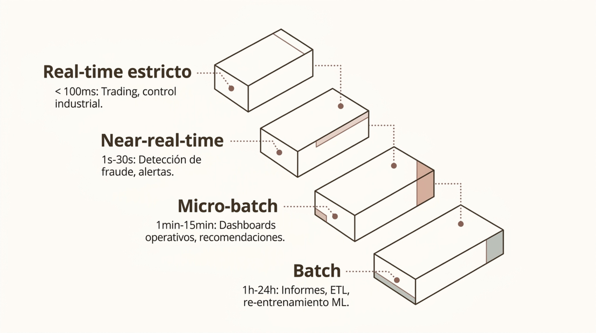

# Procesamiento distribuido: Apache Spark y arquitectura cloud

> Módulo 2 · Fundamentos del Big Data
>
> **Práctica relacionada:** [Laboratorio 2.3 — Primeros pasos con PySpark](../Labs/02-fundamentos-del-big-data/lab-2.3-primeros-pasos-pyspark/enunciado.md)

**Navegación:** [Índice general](../README.md) · [Índice del módulo](../README.md#modulo-2) · ⟵ [Anterior: Procesamiento — fundamentos y Hadoop](04a-procesamiento-fundamentos-y-hadoop.md) · [Siguiente: Governance y calidad de datos →](05-governance-y-calidad-de-datos.md)

### Apache Spark: visión general

Apache Spark es el motor de procesamiento distribuido de referencia en el ecosistema Big Data. Proporciona una API unificada para batch, streaming y Machine Learning, con un rendimiento muy superior a MapReduce gracias al uso intensivo de memoria.

- **Spark SQL** — Consultas SQL y operaciones con DataFrames sobre datos distribuidos.
- **Structured Streaming** — Procesamiento continuo de eventos con APIs estructuradas.
- **MLlib** — Algoritmos de Machine Learning escalables integrados en el ecosistema.
- **GraphX** — Procesamiento de grafos distribuidos para análisis de redes y relaciones. Actualmente obsoleto en favor de GraphFrames u otras BD de grafos.

---

### Arquitectura de Apache Spark

Spark utiliza un modelo maestro-trabajador: el Driver coordina la ejecución y los Executors procesan las tareas sobre las particiones de datos distribuidas en el clúster.

- **Driver** — Ejecuta el código principal, construye el plan lógico y lo optimiza mediante Catalyst.
- **Cluster Manager** — Negocia recursos con YARN, Kubernetes o el gestor nativo de Spark.
- **Executors** — JVMs en los nodos trabajadores que ejecutan tareas y almacenan particiones en memoria.

El flujo de trabajo conecta Driver → Cluster Manager → Executors → Tasks.

---

### DataFrames y Spark SQL

Los DataFrames son la abstracción central de Spark: colecciones de datos distribuidas con esquema, que se pueden manipular mediante una API expresiva similar a pandas o directamente con SQL estándar.

- **Select y filter** — Proyección de columnas y filtrado de filas. Operaciones narrow que no requieren movimiento de datos entre nodos.
- **Join** — Combinación de dos DataFrames por una clave. Puede generar shuffle si los datos no están co-particionados.
- **GroupBy y agg** — Agrupación y cálculo de métricas (count, sum, avg). Operaciones wide que redistribuyen datos por clave.
- **Spark SQL** — Permite ejecutar sentencias SQL estándar directamente sobre DataFrames registrados como vistas temporales.

---

### Particiones y shuffle

Las particiones son las unidades de paralelismo en Spark. Las transformaciones que requieren redistribuir datos entre particiones generan un shuffle, que es la operación más costosa en un job distribuido.

**Transformaciones narrow**
Cada partición de salida depende solo de una partición de entrada. Sin shuffle.
- map, filter, select
- flatMap, union
- Coalesce sin rebalanceo

**Transformaciones wide**
Particiones de salida dependen de múltiples particiones de entrada. Generan shuffle.
- groupBy, join, distinct
- repartition, sort
- aggregations globales

El shuffle implica escritura en disco y transferencia de red. Minimizarlo es la principal palanca de optimización de rendimiento en Spark.

---

### Structured Streaming en Spark

Structured Streaming permite expresar el procesamiento continuo de eventos con las mismas APIs de DataFrames usadas en batch. El motor gestiona internamente la llegada de datos, el estado y la tolerancia a fallos.

El flujo se organiza como: **Input Stream → Transformaciones → Checkpoints → Sink**.

- **Tumbling windows** — Ventanas fijas sin solapamiento. Ej: suma de ventas cada 5 minutos.
- **Sliding windows** — Ventanas solapadas para medias móviles o detección de tendencias.
- **Watermarks** — Política para gestionar eventos que llegan tarde al stream.

---

### MLlib: Machine Learning en Spark

MLlib es la librería de Machine Learning distribuido de Apache Spark. Proporciona algoritmos clásicos y utilidades de preparación de datos que escalan sobre clústeres, integrándose de forma nativa con DataFrames.

**Algoritmos incluidos**
- Logistic / Linear Regression
- Random Forest, Gradient Boosting
- K-Means, Bisecting K-Means
- ALS para sistemas de recomendación
- PCA y SVD para reducción dimensional

**Feature Engineering**
Transformers para normalización, encoding, tokenización y extracción de características.

**Pipelines ML**
Encadenamiento de transformaciones y estimadores en un flujo reproducible y serializable.

**Algoritmos**
Clasificación, regresión, clustering y factorización matricial distribuidos.

---

### Batch vs Streaming: ¿cuándo usar cada uno?

La elección entre batch y streaming no es simplemente técnica: depende de los requisitos de latencia del caso de uso, el coste de infraestructura y la complejidad operativa que la organización puede asumir.

| Criterio | Batch | Streaming |
| --- | --- | --- |
| Latencia objetivo | Minutos – días | Milisegundos – segundos |
| Coste | Menor (jobs periódicos) | Mayor (infraestructura continua) |
| Complejidad | Baja – media | Alta (estado, orden, late data) |
| Casos de uso | Informes diarios, ETL nocturno, re-entrenamiento ML | Detección de fraude, alertas, dashboards en vivo |
| Recomendable cuando | La decisión no requiere respuesta inmediata | La acción debe tomarse en tiempo real |

---

### Procesamiento near-real-time

No existe una única definición de "tiempo real". En la práctica, los sistemas tienen diferentes objetivos de latencia que determinan la arquitectura y el coste adecuados para cada caso de uso.

El diagrama presenta cuatro niveles de latencia, de mayor a menor exigencia:

- **Real-time estricto** — < 100ms: Trading, control industrial.
- **Near-real-time** — 1s-30s: Detección de fraude, alertas.
- **Micro-batch** — 1min-15min: Dashboards operativos, recomendaciones.
- **Batch** — 1h-24h: Informes, ETL, re-entrenamiento ML.

Aumentar la frecuencia de procesamiento incrementa el coste y la complejidad. El objetivo es elegir la **latencia mínima necesaria**, no la máxima técnicamente posible.

---

### Arquitectura cloud de referencia

Las plataformas modernas de Big Data en cloud combinan servicios gestionados especializados, separando almacenamiento y cómputo para maximizar la elasticidad y el control de costes.

- **Perímetro: ML y BI** — Modelos, dashboards y APIs de consumo.
- **Capa: Managed Compute** — Spark, Flink y motores SQL gestionados.
- **Núcleo: Object Storage** — Lake raw y curated para datos persistentes.

Esta arquitectura es vendor-neutral en su concepción: los mismos principios aplican en AWS (S3 + EMR + Redshift + SageMaker), Azure (ADLS + Synapse + AML) o GCP (GCS + Dataproc + BigQuery + Vertex AI).

---

### Coste y FinOps en Big Data

Una plataforma Big Data mal dimensionada puede generar costes desproporcionados. FinOps es la práctica de gestionar el gasto en infraestructura de datos de forma responsable, equilibrando rendimiento y coste.

- **Compute** — Uso de instancias spot o preemptibles para jobs batch. Apagado automático de clústeres inactivos. Autoscaling en streaming.
- **Storage** — Políticas de lifecycle: mover datos fríos a tiers más baratos. Compresión y formatos columnares (Parquet, ORC) para reducir tamaño.
- **Network** — Minimizar transferencia entre regiones (egress costs). Co-localizar compute y storage cuando sea posible.
- **Lifecycle** — Definir retención de datos: no todo debe guardarse indefinidamente. Eliminar datos que no aportarán valor futuro.
