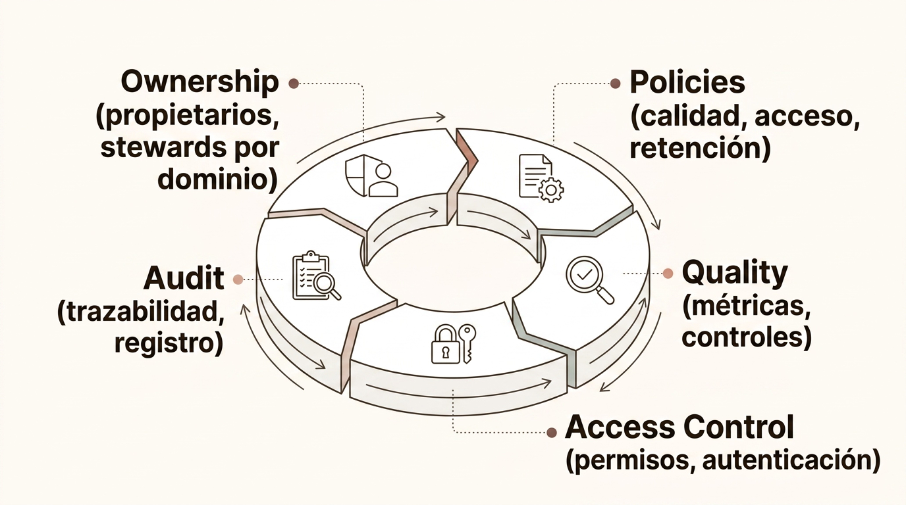
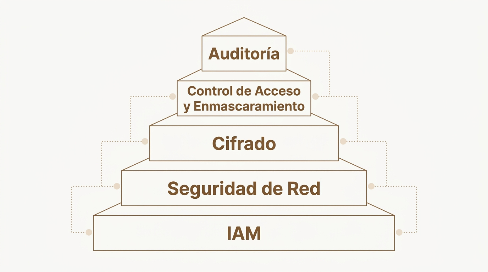

# Governance y calidad de datos

> Módulo 2 · Fundamentos del Big Data
>
> **Práctica relacionada:** [Laboratorio 2.4 — Calidad y gobierno de datos](../Labs/02-fundamentos-del-big-data/lab-2.4-calidad-gobierno-datos/enunciado.md)

**Navegación:** [Índice general](../README.md) · [Índice del módulo](../README.md#modulo-2) · ⟵ [Anterior: Procesamiento — Apache Spark](04b-procesamiento-spark.md) · [Siguiente: Casos de uso →](06-casos-de-uso.md)

> **Nota de organización:** este fichero agrupa dos bloques de contenido que **no eran consecutivos** en la presentación original. El primero (Data Catalog, Data Lineage, Data Governance) aparecía tras el bloque de arquitectura, mientras que el segundo (Seguridad de datos, Privacidad y datos personales, Data Quality, Observabilidad de datos) aparecía tras el bloque de procesamiento distribuido. Se han reunido aquí por afinidad temática, porque todos tratan de gobierno y calidad del dato — el bloque que la propia introducción de objetivos del módulo llama "Governance y calidad".

### Data Catalog

Un data catalog es el inventario inteligente de todos los activos de datos de una organización. Permite a usuarios técnicos y de negocio descubrir datasets, entender su significado y conocer sus políticas de uso.

**Qué contiene un catálogo**
- Metadata técnica: esquema, tipo, tamaño, origen.
- Ownership: propietario, equipo responsable.
- Glossary: definición de negocio de cada campo.
- Clasificación: PII, confidencial, público.
- Popularidad: uso, consultas recientes, valoraciones.

**Por qué es imprescindible**
Sin catálogo, los equipos duplican trabajo, no saben qué datos existen ni quién los gestiona. El catálogo es la base del autoservicio de datos (data self-service) y del gobierno efectivo.

---

### Data Lineage: trazabilidad del dato

El data lineage permite saber con precisión de dónde viene un dato, qué transformaciones ha sufrido y quién lo consume. Es fundamental para auditorías, resolución de incidentes de calidad y cumplimiento normativo.

El linaje sigue el recorrido: **Origen → Ingestión cruda → Limpieza y enriquecimiento → Consumidor**.

Este recorrido responde a tres tipos de preguntas:

- **Impacto** — ¿Qué se rompe si cambia este campo?
- **Root cause** — ¿Dónde se introdujo el error en el dato?
- **Compliance** — ¿Dónde residen los datos personales de este cliente?

---

### Data Governance

El gobierno de datos es el conjunto de políticas, procesos, roles y estándares que garantizan que los datos sean fiables, seguros, accesibles y usados de forma responsable en toda la organización.

El diagrama representa el gobierno de datos como un ciclo continuo con cinco componentes:

- **Ownership** (propietarios, stewards por dominio)
- **Policies** (calidad, acceso, retención)
- **Quality** (métricas, controles)
- **Access Control** (permisos, autenticación)
- **Audit** (trazabilidad, registro)

El governance no es un proyecto puntual sino un **proceso continuo**. Sin él, incluso las plataformas más potentes producen análisis poco fiables y exponen a la organización a riesgos legales y reputacionales.

---

### Seguridad de datos

La seguridad en plataformas Big Data debe aplicarse en múltiples capas de forma coordinada. Un control omitido en cualquier capa puede comprometer la integridad de todo el sistema.

El diagrama representa la seguridad como una pirámide de capas, de la base a la cima:

- **IAM** (base de la pirámide)
- **Seguridad de Red**
- **Cifrado**
- **Control de Acceso y Enmascaramiento**
- **Auditoría** (cima de la pirámide)

El principio de **mínimo privilegio** (*least privilege*) debe aplicarse a todos los niveles: usuarios, servicios, pipelines y aplicaciones acceden exclusivamente a los datos que necesitan para su función.

---

### Privacidad y datos personales

La escala del Big Data amplifica los riesgos de privacidad: pequeños datos aparentemente inocuos pueden combinarse para identificar a personas. Las normativas como el RGPD establecen obligaciones específicas para el tratamiento masivo de datos.

- **Minimización** — Recoger solo los datos estrictamente necesarios para la finalidad declarada. No acumular "por si acaso".
- **Limitación de finalidad** — Los datos recogidos para un propósito no pueden reutilizarse para otro incompatible sin base legal.
- **Pseudonimización** — Sustituir identificadores directos por tokens para reducir el riesgo sin eliminar la utilidad analítica.

---

### Data Quality como proceso continuo

La calidad de los datos no se garantiza en un único punto de control: debe verificarse y corregirse a lo largo de todo el pipeline, desde la ingestión hasta el serving.

El pipeline recorre las etapas: **Ingestión → Transformación → Almacenamiento → Serving**, con controles de calidad en cada una:

- **Schema checks** — Detectar cambios inesperados de tipos o columnas.
- **Null checks** — Verificar completitud de campos obligatorios.
- **Range validation** — Valores dentro de rangos de negocio esperados.
- **Deduplication** — Identificar y gestionar registros duplicados.

---

### Observabilidad de datos

La observabilidad de datos (data observability) es la capacidad de monitorizar el estado y la salud de los pipelines y datasets de forma proactiva, detectando anomalías antes de que impacten en análisis o decisiones.

- **Freshness** — ¿Cuándo fue actualizado por última vez este dataset? Alertas si los datos no llegan en el tiempo esperado.
- **Volume** — Monitorizar el número de registros procesados. Desviaciones bruscas indican fallos en el origen o en la ingestión.
- **Schema drift** — Detectar cambios inesperados en la estructura de los datos que pueden romper pipelines o modelos downstream.
- **Lineage** — Saber qué datasets dependen de un origen problemático para evaluar el impacto y priorizar la corrección.
