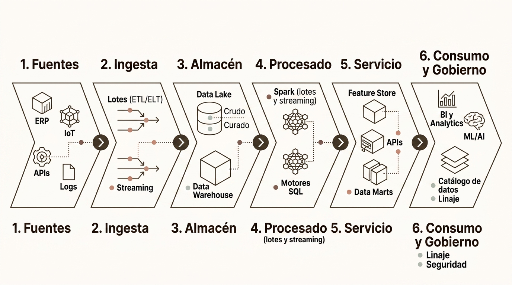

# Casos de uso

> Módulo 2 · Fundamentos del Big Data
>
> **Práctica relacionada:** [Laboratorio 2.5 — Caso de uso end-to-end (integrador)](../Labs/02-fundamentos-del-big-data/lab-2.5-caso-uso-end-to-end/enunciado.md)

**Navegación:** [Índice general](../README.md) · [Índice del módulo](../README.md#modulo-2) · ⟵ [Anterior: Governance y calidad de datos](05-governance-y-calidad-de-datos.md) · [Siguiente: Introducción y objetivos →](../03-herramientas-y-tecnologias/00-introduccion-y-objetivos.md)

### Big Data como base para la IA

Las plataformas Big Data son la infraestructura fundamental sobre la que se construyen los sistemas de Inteligencia Artificial. Sin datos de calidad, escala y pipeline robusto, los modelos de ML/IA no pueden entrenarse ni desplegarse de forma fiable.

- **Data Platform** — Almacenamiento y procesamiento a escala.
- **Feature Store** — Preparación y características reutilizables.
- **Model Training** — Entrenamiento de modelos ML/IA.
- **Model Serving** — Predicciones en batch y en tiempo real.

La mayor parte del tiempo en proyectos de IA se dedica a preparación de datos. Una buena plataforma Big Data convierte ese coste en ventaja competitiva.

---

### Caso de uso: detección de fraude financiero

La detección de fraude en tiempo real es uno de los casos de uso más representativos del streaming en Big Data. Cada transacción debe evaluarse en milisegundos para activar controles sin interrumpir la experiencia del cliente.

- **Transacciones** — Eventos de pago en tiempo real.
- **Extracción** — Velocidad, geolocalización, historial.
- **Stream Processing** — Kafka y Structured Streaming en Spark.
- **Scoring** — Modelo ML de detección.

El reto clave es gestionar el umbral de sensibilidad: demasiados falsos positivos degradan la experiencia del cliente; demasiados falsos negativos generan pérdidas. Los modelos se retroalimentan con nuevas etiquetas de fraude confirmado.

---

### Caso de uso: IoT industrial

Una planta industrial moderna puede contar con miles de sensores emitiendo lecturas cada segundo. La arquitectura debe gestionar la ingestión masiva, el almacenamiento eficiente de series temporales y el análisis para mantenimiento predictivo.

- **Sensores y PLCs** — Miles de dispositivos en planta.
- **Ingestión a escala** — Kafka / IoT Hub para transporte.
- **Edge Processing** — Filtrado y agregación local.
- **Almacenamiento** — Time-series y Data Lake.
- **Procesamiento y ML** — Detección de anomalías y mantenimiento.

El mantenimiento predictivo es el caso de uso de mayor retorno: anticipar fallos de maquinaria reduce paradas no planificadas y extiende la vida útil de los equipos, con un impacto directo en costes operativos.

---

### Caso de uso: salud y genómica

El sector salud combina grandes volúmenes, alta variedad y requisitos de gobierno muy estrictos. La genómica, las historias clínicas electrónicas y las imágenes médicas convergen en plataformas que requieren máxima seguridad y trazabilidad.

- **Genómica** — Un genoma humano ocupa ~200 GB en crudo. El análisis comparativo de miles de pacientes requiere computación distribuida masiva para identificar variantes genéticas asociadas a enfermedades.
- **Historias clínicas (EHR)** — Datos semiestructurados con información de diagnósticos, medicamentos y procedimientos. Fuente clave para epidemiología y modelos de predicción clínica.
- **Imagen médica** — Radiografías, TACs y resonancias en formatos DICOM. Almacenamiento de alto volumen y procesamiento con modelos de visión para diagnóstico asistido.

Todo ello bajo cumplimiento normativo estricto: RGPD, HIPAA (EE.UU.) y pseudonimización obligatoria de datos de pacientes.

---

### Caso de uso: retail y recomendación

El retail digital genera un volumen continuo de señales de comportamiento que, combinadas con datos transaccionales y de catálogo, permiten construir una visión completa del cliente (Customer 360) para personalización y recomendación.

**Fuentes de datos**
- Clickstream: navegación, búsquedas, tiempo en página.
- Transacciones: compras, devoluciones, cupones.
- Catálogo: productos, precios, categorías, stock.
- CRM: segmentos, historial de contacto.

**Aplicaciones analíticas**
- Segmentación RFM y propensión a compra.
- Recomendación colaborativa (collaborative filtering).
- Pricing dinámico según demanda y competencia.
- Predicción de churn y campañas de retención.

---

### Caso de uso: energía y medio ambiente

Las redes de energía y los sistemas medioambientales combinan IoT a gran escala, datos meteorológicos y series temporales para previsión de demanda, detección de anomalías y optimización de la distribución.

- **Sensores y red** — Miles de sensores en turbinas, paneles solares y subestaciones emiten lecturas de potencia, tensión y frecuencia en tiempo real.
- **Datos climáticos** — Integración de modelos meteorológicos para anticipar producción eólica y solar y ajustar la generación de respaldo.
- **Optimización** — Modelos de previsión de demanda (load forecasting) y algoritmos de optimización reducen el coste de balanceo de la red.

---

### Arquitectura final: plataforma Big Data moderna

Una plataforma Big Data moderna integra seis capas funcionales bien diferenciadas. Esta separación de responsabilidades permite evolucionar cada componente de forma independiente y adoptar las mejores herramientas para cada función.

Las seis capas y sus componentes son:

1. **Fuentes** — ERP, IoT, APIs, Logs.
2. **Ingesta** — Lotes (ETL/ELT), Streaming.
3. **Almacén** — Data Lake (Crudo, Curado), Data Warehouse.
4. **Procesado** (lotes y streaming) — Spark, Motores SQL.
5. **Servicio** — Feature Store, APIs, Data Marts.
6. **Consumo y Gobierno** — BI y Analytics, ML/AI, Catálogo de datos, Linaje, Seguridad.

El **gobierno de datos** (catálogo, linaje, calidad, seguridad y privacidad) actúa como capa transversal que acompaña a todas las demás, garantizando que los datos sean fiables, trazables y seguros en cada etapa del ciclo de vida.

---

### Puente hacia las herramientas

Comprender la arquitectura Big Data es el punto de partida imprescindible. Las herramientas y tecnologías del ecosistema no son decisiones arbitrarias: cada una existe para resolver un problema concreto de la arquitectura que acabamos de explorar.

- **Arquitectura Big Data** — Capas, patrones y principios del módulo 2.
- **Herramientas y lenguajes** — Python, SQL, Spark, Kafka, dbt y plataformas cloud.
- **Soluciones e IA** — Módulo 3: aplicación práctica para construir soluciones analíticas e inteligentes.

Cada herramienta del módulo siguiente tiene su razón de ser en una capa de esta arquitectura. Mantén ese mapa mental activo mientras avanzamos.
