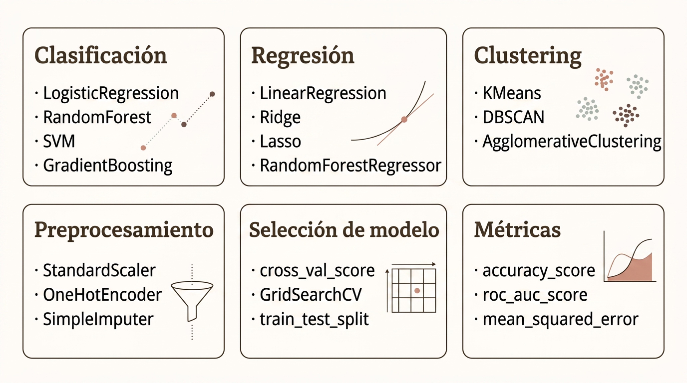

# ML, DL y Evaluación

> Módulo 3 · Herramientas y Tecnologías para IA y Big Data
>
> **Práctica relacionada:** [Laboratorio 3.4 — Clasificación con scikit-learn: de los datos a las métricas](../Labs/03-herramientas-y-tecnologias/lab-3.4-clasificacion-scikit-learn/enunciado.md)

**Navegación:** [Índice general](../README.md) · [Índice del módulo](../README.md#modulo-3) · ⟵ [Anterior: Spark y procesamiento distribuido](03-spark-y-procesamiento-distribuido.md) · [Siguiente: BI y visualización →](05-bi-y-visualizacion.md)

### TensorFlow y PyTorch

TensorFlow y PyTorch son los dos frameworks de Deep Learning dominantes. Ambos permiten construir, entrenar y desplegar redes neuronales, pero con filosofías de diseño y ecosistemas distintos.

| Aspecto | PyTorch | TensorFlow / Keras |
| --- | --- | --- |
| Paradigma | Define-by-run (eager por defecto) | Graph estático + eager mode |
| Comunidad científica | Dominante en investigación | Fuerte en producción empresarial |
| API de alto nivel | torch.nn, Lightning | Keras (integrado) |
| Autodiff | autograd | GradientTape |
| Aceleradores | CUDA, MPS, XLA, ROCm | CUDA, TPU, XLA |
| Despliegue | TorchServe, ONNX, TorchScript | TensorFlow Serving, TFLite, TF.js |

La frontera entre ambos frameworks se estrecha: PyTorch lidera en investigación; TensorFlow/Keras mantiene presencia fuerte en producción empresarial y mobile.

---

### PyTorch Moderno

Las versiones modernas de PyTorch han evolucionado más allá del prototipado de investigación para ofrecer capacidades de producción avanzadas: compilación, entrenamiento distribuido y optimización de inferencia.

- **torch.compile**: compilación just-in-time del modelo para acelerar el entrenamiento e inferencia sin cambiar el código. Usa TorchDynamo e Inductor como backend.
- **Entrenamiento distribuido**: `torch.distributed` y FSDP (Fully Sharded Data Parallel) permiten entrenar modelos de cientos de miles de millones de parámetros en múltiples GPUs o nodos.
- **Soporte de aceleradores**: compatible con NVIDIA CUDA, AMD ROCm, Apple MPS (Metal) y Google XLA/TPU. Diseño agnóstico al hardware de aceleración.
- **Optimización de inferencia**: quantización, pruning, exportación a ONNX y TorchScript para reducir latencia y memoria en despliegue.

---

### TensorFlow y Keras

Keras ofrece una API de alto nivel, legible y modular para construir redes neuronales. Originalmente independiente, hoy forma parte central del ecosistema TensorFlow y soporta múltiples backends según configuración.

- **Layers y Models**: bloques constructivos: capas densas, convolucionales, recurrentes, de atención. Se combinan secuencialmente (Sequential) o en grafo funcional (Model).
- **Training loop**: `model.compile()` define optimizador, función de pérdida y métricas. `model.fit()` ejecuta el entrenamiento con validación, callbacks y logging automáticos.
- **Deployment**: TensorFlow Serving para APIs REST/gRPC; TFLite para móvil y edge; TF.js para navegador; SavedModel para portabilidad.

El ecosistema TensorFlow incluye TensorBoard (visualización de entrenamiento), TF Data (pipelines de entrada eficientes) y TF Hub (modelos preentrenados reutilizables).

---

### scikit-learn: ML Clásico en Python

scikit-learn es la librería de referencia para machine learning clásico en Python. Ofrece una API unificada (`fit` / `predict` / `transform`) que permite intercambiar algoritmos con mínimos cambios de código.

El diagrama tiene seis bloques que resumen las funcionalidades principales de la librería:

- **Clasificación**: LogisticRegression, RandomForest, SVM, GradientBoosting.
- **Regresión**: LinearRegression, Ridge, Lasso, RandomForestRegressor.
- **Clustering**: KMeans, DBSCAN, AgglomerativeClustering.
- **Preprocesamiento**: StandardScaler, OneHotEncoder, SimpleImputer.
- **Selección de modelo**: cross_val_score, GridSearchCV, train_test_split.
- **Métricas**: accuracy_score, roc_auc_score, mean_squared_error.

La consistencia de la API permite construir **pipelines** encadenando pasos de preprocesamiento y estimadores, garantizando que el mismo proceso se aplique a datos de entrenamiento, validación y producción.

---

### Clasificación

La clasificación es uno de los problemas supervisados más comunes en ML: dado un conjunto de características de una observación, el modelo asigna esa observación a una categoría predefinida.

**Casos de uso frecuentes**

- Detección de spam: email es spam o no.
- Detección de fraude: transacción fraudulenta o legítima.
- Churn: cliente abandonará el servicio o permanecerá.
- Diagnóstico médico: imagen contiene patología o no.
- Clasificación multiclase: categoría de producto entre N clases.

**Algoritmos representativos**

- **Árboles de decisión**: reglas jerárquicas interpretables. Fáciles de explicar pero propensos al sobreajuste sin regularización.
- **Random Forest**: ensemble de árboles con muestreo aleatorio. Robusto, generaliza bien, proporciona importancia de variables.
- **Gradient Boosting (XGBoost, LightGBM)**: construcción secuencial de árboles correctores. Estado del arte en datos tabulares estructurados.

---

### Regresión

La regresión estima valores numéricos continuos a partir de características. Es el tipo de problema supervisado apropiado cuando la variable a predecir no pertenece a categorías sino a un rango real.

**Ejemplos conceptuales**

- **Precio de vivienda**: estimar el precio de una propiedad a partir de m², ubicación, antigüedad y otras características del inmueble.
- **Previsión de demanda**: estimar las unidades que se venderán el próximo mes para optimizar stock, producción y logística.
- **Consumo energético**: predecir el consumo eléctrico de un edificio en función de temperatura, ocupación y hora del día.

**Algoritmos**

- **Regresión lineal**: relación lineal entre features y target. Interpretable, rápida, buen punto de partida. Sensible a outliers y no captura no-linealidades.
- **Ridge / Lasso**: regresión lineal con regularización L2 o L1. Controla el sobreajuste y puede seleccionar variables relevantes (Lasso).
- **Árboles y ensembles**: capturan relaciones no lineales e interacciones entre variables. Gradient Boosting es el estado del arte en datos tabulares.

---

### Clustering

El clustering es un problema de aprendizaje no supervisado: el modelo agrupa observaciones según similitud sin disponer de etiquetas o categorías predefinidas. El objetivo es descubrir estructura latente en los datos.

**Aplicaciones conceptuales**

- Segmentación de clientes: agrupar por comportamiento de compra para campañas personalizadas.
- Segmentación de mercados: identificar grupos de países o regiones con características similares.
- Análisis de documentos: agrupar textos por temática sin categorías previas.
- Exploración inicial: descubrir patrones antes de diseñar modelos supervisados.

**Algoritmos principales**

- **K-Means**: divide los datos en K grupos minimizando la distancia intracluster. Rápido y escalable. Requiere especificar K y asume clusters esféricos.
- **DBSCAN**: basado en densidad. Detecta clusters de forma arbitraria y clasifica como ruido los puntos aislados. No requiere especificar K.
- **Jerárquico**: construye un dendrograma de agrupaciones. Permite visualizar la estructura de clusters a distintos niveles de granularidad.

---

### Detección de Anomalías

La detección de anomalías (anomaly detection) identifica observaciones que se desvían significativamente del patrón habitual. Es crítica en contextos donde los eventos anómalos tienen alto impacto y son infrecuentes.

- **Fraude financiero**: transacciones con patrones inusuales de importe, frecuencia o ubicación respecto al historial del usuario.
- **Sensores industriales (IoT)**: lecturas de temperatura, vibración o presión fuera del rango normal que anticipan fallos de maquinaria.
- **Ciberseguridad**: tráfico de red, patrones de acceso o comportamiento de usuarios que no coinciden con la línea base establecida.
- **Control de calidad**: productos con características fuera de tolerancia en líneas de fabricación. Inspección visual automatizada.

---

### Train, Validation y Test

La separación correcta de los datos es la base de una evaluación honesta. Sin ella, es imposible estimar cuánto generalizará el modelo a datos nuevos, que es su único objetivo real.

- **Train**: 60-70% — el modelo aprende parámetros.
- **Validation**: 15-20% — ajustar hiperparámetros y comparar.
- **Test**: 15-20% — evaluar rendimiento final una vez.

**¿Por qué tres conjuntos?**

Usar el conjunto de test para seleccionar modelos introduce data leakage: el test deja de ser un estimador imparcial del rendimiento real. El conjunto de validación absorbe las decisiones de ajuste.

**Cross-validation (validación cruzada)**

Divide los datos en K particiones (folds) y entrena K modelos, usando cada fold como validación una vez. Proporciona una estimación más robusta del rendimiento con menos datos.

---

### Overfitting y Underfitting

El objetivo del aprendizaje automático es aprender patrones que generalicen a datos nuevos, no memorizar los datos de entrenamiento. Los dos errores opuestos son el sobreajuste y el infraajuste.

- **Underfitting (sesgo alto)**: el modelo es demasiado simple para capturar la estructura de los datos. Error alto tanto en entrenamiento como en validación. Solución: aumentar complejidad del modelo o añadir features.
- **Overfitting (varianza alta)**: el modelo memoriza los datos de entrenamiento. Error muy bajo en train pero alto en validación. Solución: regularización, más datos, menos complejidad.
- **Good fit**: el modelo captura el patrón real sin memorizar el ruido. Error bajo y similar en train y validación. Objetivo del entrenamiento.

---

### Métricas de Clasificación

Elegir la métrica correcta depende del problema. Accuracy puede ser engañosa cuando las clases están desbalanceadas: un modelo que siempre predice la clase mayoritaria puede tener alta precisión sin ser útil.

**Matriz de confusión**

|  | Pred. Positivo | Pred. Negativo |
| --- | --- | --- |
| Real Positivo | TP (Verdadero +) | FN (Falso -) |
| Real Negativo | FP (Falso +) | TN (Verdadero -) |

**Métricas derivadas**

- **Precision**: TP / (TP+FP). ¿De los que predigo positivos, cuántos lo son realmente? Clave cuando los falsos positivos son costosos (spam).
- **Recall (Sensibilidad)**: TP / (TP+FN). ¿De los positivos reales, cuántos detecto? Clave cuando los falsos negativos son costosos (fraude, diagnóstico).
- **F1 Score**: media armónica de Precision y Recall. Balance entre ambas métricas. Útil con clases desbalanceadas.
- **ROC-AUC**: área bajo la curva ROC. Mide la capacidad discriminativa del modelo a todos los umbrales. 1.0 = perfecto; 0.5 = aleatorio.

---

### Métricas de Regresión

Las métricas de regresión cuantifican la diferencia entre los valores predichos y los valores reales. Cada métrica tiene propiedades distintas y responde a preguntas diferentes sobre la calidad del modelo.

| Métrica | Definición | Interpretación | Sensibilidad a outliers |
| --- | --- | --- | --- |
| MAE | Media del valor absoluto de los errores | Error promedio en las mismas unidades que el target | Baja |
| MSE | Media del cuadrado de los errores | Penaliza errores grandes más que MAE | Alta |
| RMSE | Raíz cuadrada de MSE | Mismas unidades que el target; interpretable | Alta |
| R² | Proporción de varianza explicada por el modelo | 1.0 = ajuste perfecto; 0 = igual que la media | Media |

No existe una métrica universalmente mejor. La elección depende del contexto: en logística, MAE en días es directamente interpretable; en modelos de riesgo, RMSE penaliza errores grandes, lo cual puede ser deseable.

---

### Pipelines de ML

Un pipeline de ML encapsula la secuencia completa de preprocesamiento y modelado en un único objeto. Esto garantiza que las mismas transformaciones se apliquen consistentemente en entrenamiento, validación y producción.

El pipeline típico encadena: **Preprocesado → Estimador → Predicción**.

- **Evitar data leakage**: al encapsular todo en un pipeline, el scaler o el imputer solo aprende parámetros de los datos de entrenamiento, nunca de validación o test.
- **Compatibilidad con CV y tuning**: GridSearchCV y cross_val_score funcionan directamente sobre pipelines, permitiendo optimizar hiperparámetros de cualquier paso.
- **Reproducibilidad**: un pipeline puede serializarse (joblib, pickle) y desplegarse garantizando exactamente el mismo comportamiento que en desarrollo.

---

### Interpretabilidad y Explicabilidad

A medida que los modelos de ML se despliegan en decisiones con impacto real (crédito, diagnóstico, RRHH), la capacidad de explicar sus predicciones pasa de ser opcional a ser un requisito regulatorio y ético.

**¿Por qué importa?**

- Regulación: GDPR exige explicar decisiones automatizadas que afectan a personas.
- Confianza: los usuarios confían más en sistemas que pueden explicar sus recomendaciones.
- Debugging: las explicaciones revelan si el modelo usa proxies espurios o datos contaminados.
- Mejora iterativa: entender qué features importan guía el siguiente ciclo de feature engineering.

**Tipos de explicación**

- **Feature importance global**: ¿qué variables influyen más en las predicciones del modelo en general? Disponible de forma nativa en árboles y ensembles.
- **Explicaciones locales (SHAP, LIME)**: ¿por qué el modelo predijo X para esta observación concreta? Fundamental para auditoría de decisiones individuales.
- **Modelos inherentemente interpretables**: regresión lineal, árboles de decisión de profundidad reducida. Transparentes por diseño, pero pueden ser menos precisos.

---
