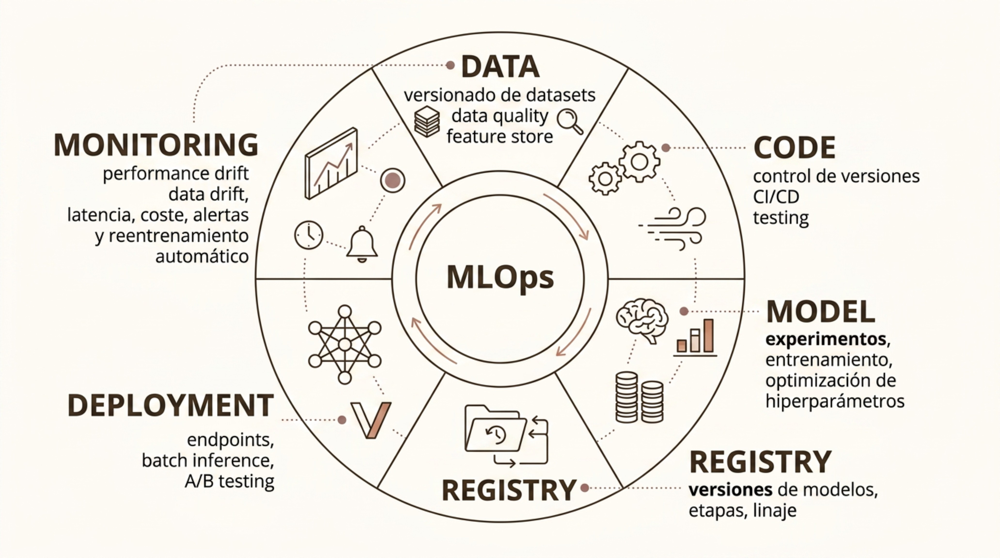
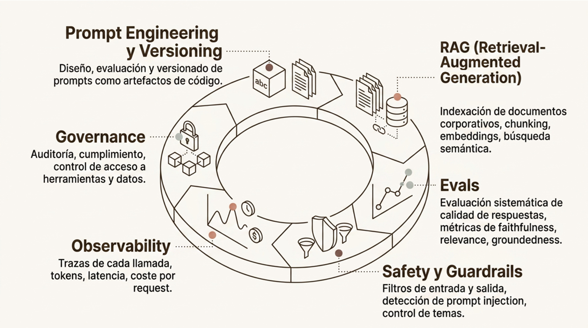
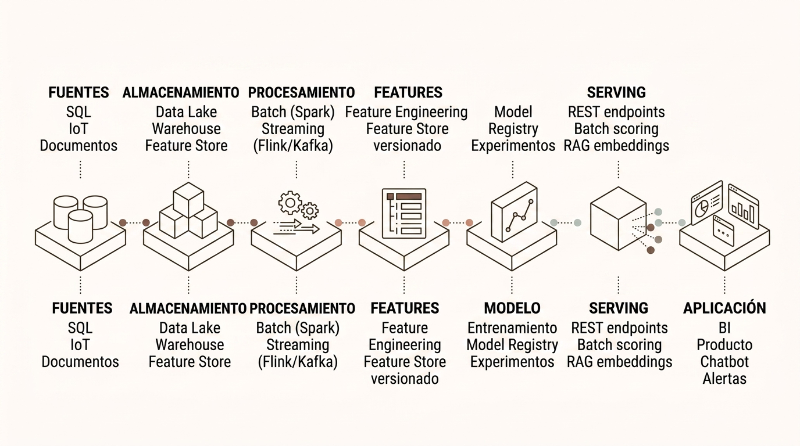

# Cloud y MLOps

> Módulo 3 · Herramientas y Tecnologías para IA y Big Data
>
> **Práctica relacionada:** [Laboratorio 3.6 — Despliega un modelo simple en la nube](../Labs/03-herramientas-y-tecnologias/lab-3.6-despliegue-gradio/enunciado.md)

**Navegación:** [Índice general](../README.md) · [Índice del módulo](../README.md#modulo-3) · ⟵ [Anterior: BI y visualización](05-bi-y-visualizacion.md) · [Siguiente: Casos conceptuales y cierre →](07-casos-conceptuales-y-cierre.md)

### Cloud para IA y ML

El cloud ha democratizado el acceso a infraestructura de cómputo de alto rendimiento, almacenamiento elástico y servicios gestionados de ML. Permite escalar experimentos y despliegues sin inversión en hardware propio.

- **Cómputo elástico**: instancias bajo demanda, desde VMs de propósito general hasta nodos con GPU/TPU para entrenamiento de modelos grandes. Se paga solo por el tiempo de uso.
- **Aceleradores (GPU/TPU)**: esenciales para entrenar modelos de DL. Los tres grandes clouds ofrecen instancias con NVIDIA Blackwell B200/GB200, y Google TPUv7 "Ironwood" para workloads TensorFlow/JAX.
- **Almacenamiento escalable**: object storage (S3, ADLS, GCS) para datasets y artefactos de modelos. Desacoplado del cómputo: los datos persisten independientemente del clúster.
- **Servicios gestionados de ML**: plataformas que abstraen la infraestructura: entrenamiento, tracking de experimentos, model registry, endpoints de inferencia y monitoring incluidos.

---

### AWS: Amazon SageMaker AI

Amazon SageMaker AI es la plataforma gestionada de ML de AWS. Cubre el ciclo completo del modelo, desde la experimentación hasta la operación en producción, con servicios integrados para cada fase.

**Fases del ciclo**

- **Preparación**: Data Wrangler y Feature Store.
- **Entrenamiento**: jobs gestionados con GPU y on-demand.
- **Evaluación**: SageMaker Experiments y métricas.
- **Despliegue**: endpoints, Batch Transform y serverless.
- **Monitorización**: Model Monitor para drift y calidad.

**Componentes clave**

- **Training jobs**: ejecutan scripts de entrenamiento en contenedores gestionados con cualquier framework (PyTorch, TF, scikit-learn). Escalan automáticamente a instancias GPU.
- **Pipelines**: orquestación de pasos de ML como DAGs: preprocesamiento, entrenamiento, evaluación y despliegue condicional.
- **Model Monitor**: detecta data drift y degradación de calidad en tiempo real sobre endpoints en producción.

---

### Azure Machine Learning

Azure Machine Learning es la plataforma MLOps de Microsoft en Azure. Ofrece un workspace unificado para gestionar el ciclo completo: desde la experimentación hasta el despliegue y la gobernanza de modelos.

- **Workspace y Studio**: entorno centralizado con Designer visual, notebooks, datasets, experimentos y assets de ML en un único portal.
- **Compute**: clústeres de CPU/GPU bajo demanda, instancias de entrenamiento gestionadas y cómputo Kubernetes para inferencia.
- **Model Registry**: almacén versionado de modelos con metadatos, linaje y etapas (dev/staging/production). Integrado con pipelines de CI/CD.
- **Managed Endpoints**: despliegue de modelos como endpoints REST con auto-scaling, A/B testing y monitorización integrada sin gestionar infraestructura.

---

### Google Cloud Vertex AI

Vertex AI es la plataforma unificada de IA y ML de Google Cloud. Integra desarrollo, entrenamiento, despliegue y gestión de modelos clásicos y generativos en un único entorno.

- **Workbench y Colab Enterprise**: notebooks gestionados con acceso directo a GPUs/TPUs y al ecosistema de datos de Google Cloud (BigQuery, GCS, Dataflow).
- **Training y Pipelines**: custom training jobs, AutoML, y Vertex AI Pipelines basadas en Kubeflow. Orquestación reproducible de workloads de ML.
- **Model Garden**: catálogo de modelos preentrenados de Google y terceros, incluyendo la familia Gemini, accesibles para fine-tuning y despliegue.
- **Endpoints y Monitoring**: despliegue gestionado con feature attribution monitoring, skew detection y explicaciones integradas vía Vertex Explainable AI.

---

### Comparativa Conceptual de Clouds

Los tres grandes proveedores ofrecen capacidades equivalentes para ML, pero con arquitecturas, servicios y ecosistemas propios. La elección raramente es solo técnica; también considera acuerdos empresariales, skills del equipo y ecosistema existente.

| Criterio | AWS (SageMaker) | Azure ML | Google Vertex AI |
| --- | --- | --- | --- |
| Ecosistema base | AWS (S3, EC2, Lambda) | Microsoft (Azure, Office 365) | Google (BigQuery, GKE) |
| Integración datos | S3, Glue, Redshift | ADLS, Synapse, Fabric | BigQuery, GCS, Dataflow |
| Fortaleza GenAI | Bedrock (modelos externos) | Microsoft Foundry | Gemini nativo en Vertex |
| Perfil MLOps | Completo, granular | Integrado con DevOps/GitHub | Kubeflow-based, open |
| Ventaja competitiva | Amplitud de servicios | Integración empresarial MS | TPU, BigQuery ML, IA de Google |

---

### MLOps

MLOps es la disciplina que aplica principios de DevOps y de ingeniería de software al ciclo de vida de los modelos de ML. Un modelo en producción sin MLOps envejece silenciosamente: su rendimiento se degrada sin que nadie lo detecte.

El diagrama original representa el ciclo MLOps como una rueda con seis fases:

- **Data**: versionado de datasets, data quality, feature store.
- **Code**: control de versiones, CI/CD, testing.
- **Model**: experimentos, entrenamiento, optimización de hiperparámetros.
- **Registry**: versiones de modelos, etapas, linaje.
- **Deployment**: endpoints, batch inference, A/B testing.
- **Monitoring**: performance drift, data drift, latencia, coste, alertas y reentrenamiento automático.

El ciclo MLOps es iterativo: el monitoring detecta degradación, que dispara un nuevo ciclo de reentrenamiento, validación y despliegue. La automatización de este ciclo es el indicador de madurez MLOps de una organización.

---

### Model Registry y Promoción

El model registry es el sistema de registro centralizado de versiones de modelos entrenados. Permite controlar qué versión está activa en cada entorno y proporciona trazabilidad completa desde el experimento hasta producción.

**Flujo de promoción**

- **Experiment**: entrenamientos y tracking con MLflow.
- **Registry**: registrar modelo con métricas y metadatos.
- **Staging**: validación en preproducción y pruebas.
- **Production**: servicio en vivo con monitoring y rollback.

**Versionado semántico**

Cada versión de modelo tiene un identificador único, sus métricas de evaluación, el dataset usado para entrenarlo y el código exacto. Permite auditoría y reproducción.

**Herramientas**

MLflow Model Registry (open source), SageMaker Model Registry, Azure ML Registry, Vertex AI Model Registry. Todas integran con sus respectivos pipelines de CI/CD.

---

### Model Monitoring

Un modelo desplegado opera en un entorno cambiante. Los datos del mundo real evolucionan, los patrones de usuario cambian y el modelo puede degradarse gradualmente sin errores explícitos en la aplicación.

- **Data Drift**: la distribución de los datos de entrada cambia respecto a la del entrenamiento. Puede deberse a cambios estacionales, de negocio o de comportamiento de usuarios.
- **Concept Drift**: la relación entre features y target cambia. El modelo aprende un patrón que ya no es válido. Difícil de detectar sin ground truth en tiempo real.
- **Performance Monitoring**: seguimiento de métricas de negocio (tasa de aceptación, conversión) y de modelo (accuracy, F1) cuando el ground truth está disponible.
- **Latencia y Coste**: tiempo de respuesta del endpoint y coste por inferencia. Esenciales para SLAs y eficiencia operativa, especialmente en modelos LLM.

---

### LLMOps y Sistemas GenAI

Los sistemas de IA generativa introducen dimensiones de operación que van más allá del MLOps clásico: los modelos no se reentrenan en cada ciclo, pero los prompts, el contexto recuperado y los guardrails evolucionan continuamente.

El diagrama original presenta un diagrama circular con seis áreas operativas de LLMOps:

- **Prompt Engineering y Versioning**: diseño, evaluación y versionado de prompts como artefactos de código.
- **RAG (Retrieval-Augmented Generation)**: indexación de documentos corporativos, chunking, embeddings, búsqueda semántica.
- **Evals**: evaluación sistemática de calidad de respuestas, métricas de faithfulness, relevance, groundedness.
- **Safety y Guardrails**: filtros de entrada y salida, detección de prompt injection, control de temas.
- **Observability**: trazas de cada llamada, tokens, latencia, coste por request.
- **Governance**: auditoría, cumplimiento, control de acceso a herramientas y datos.

Las herramientas emergentes como LangSmith, Weights & Biases Weave o Microsoft Foundry cubren específicamente estas necesidades operativas del ecosistema GenAI.

---

### Seguridad de Aplicaciones de IA

Las aplicaciones de IA generativa exponen nuevas superficies de ataque que no existen en software convencional. Requieren controles específicos además de las medidas de seguridad estándar.

- **Prompt Injection**: un atacante introduce instrucciones maliciosas en el input que manipulan el comportamiento del LLM. Puede ocurrir en prompts directos (usuario) o indirectos (documentos recuperados por RAG).
- **Data Leakage**: el modelo puede revelar información del contexto del sistema, datos de otros usuarios o documentos sensibles si no se controla el acceso a las fuentes de recuperación.
- **Tool Permissions**: los agentes de IA pueden invocar herramientas (APIs, bases de datos, email). El principio de mínimo privilegio debe aplicarse: cada herramienta solo accede a lo estrictamente necesario.
- **Output Validation**: las respuestas del modelo deben validarse antes de mostrarse o usarse en sistemas downstream: detección de contenido dañino, verificación de formato y consistencia factual.
- **Auditoría y Trazabilidad**: registrar cada interacción con timestamps, usuario, prompt y respuesta permite investigar incidentes, detectar abusos y cumplir con requisitos regulatorios.

---

### Arquitectura de Referencia: Del Dato a la IA

Las herramientas estudiadas se combinan en una cadena extremo a extremo que comienza en las fuentes de datos y termina en una aplicación que genera valor. Esta arquitectura de referencia integra todas las capas del stack.

El diagrama original representa esta cadena como siete etapas encadenadas, cada una con sus componentes representativos:

- **Fuentes**: SQL, IoT, Documentos.
- **Almacenamiento**: Data Lake, Warehouse, Feature Store.
- **Procesamiento**: Batch (Spark), Streaming (Flink/Kafka).
- **Features**: Feature Engineering, Feature Store versionado.
- **Modelo**: Entrenamiento, Model Registry, Experimentos.
- **Serving**: REST endpoints, Batch scoring, RAG embeddings.
- **Aplicación**: BI, Producto, Chatbot, Alertas.

No todas las arquitecturas requieren todas las capas. La complejidad debe justificarse por el volumen, la latencia requerida y el ciclo de actualización del modelo.

---
