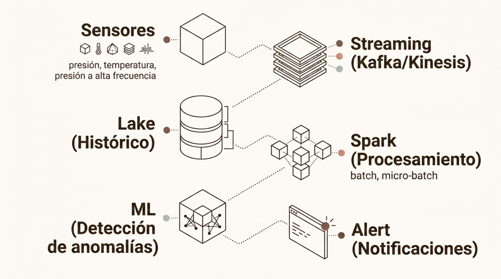
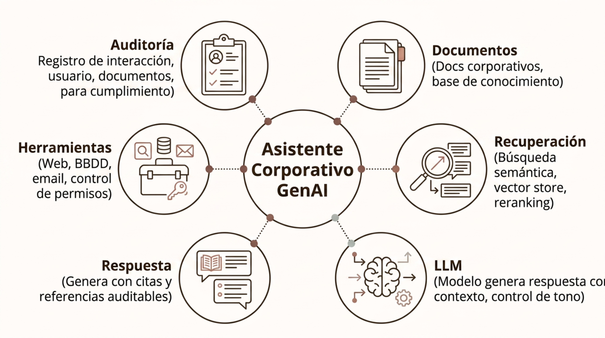
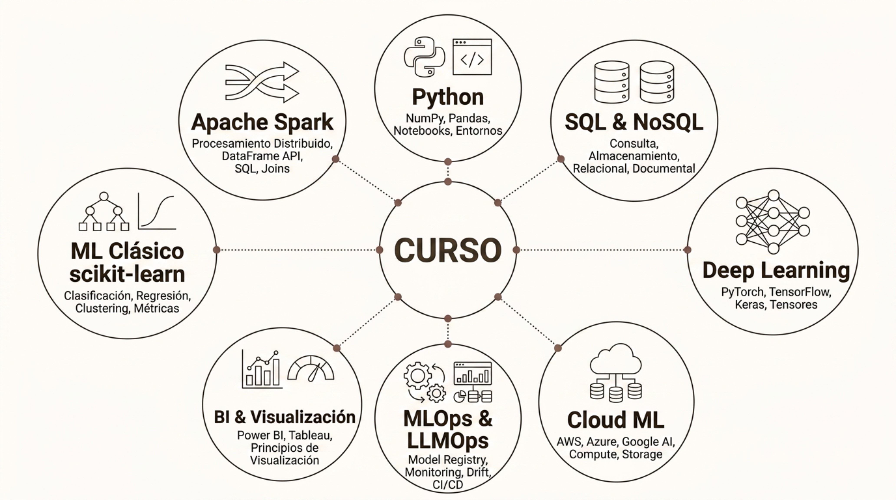

# Casos Conceptuales y Cierre

> Módulo 3 · Herramientas y Tecnologías para IA y Big Data
>
> **Práctica relacionada:** [Laboratorio 3.7 — Caso conceptual de principio a fin: predicción de churn (integrador)](../Labs/03-herramientas-y-tecnologias/lab-3.7-caso-churn-integrador/enunciado.md)
> **También citado en:** [Laboratorio 3.6 — Despliega un modelo simple en la nube](../Labs/03-herramientas-y-tecnologias/lab-3.6-despliegue-gradio/enunciado.md) (cita el bloque "Del Prototipo a Producción" de este apunte)

**Navegación:** [Índice general](../README.md) · [Índice del módulo](../README.md#modulo-3) · ⟵ [Anterior: Cloud y MLOps](06-cloud-y-mlops.md)

### Caso Conceptual: Predicción de Churn

La predicción de churn ilustra cómo un problema empresarial concreto se traduce en un pipeline de ML clásico, integrando todas las fases desde la definición del problema hasta la acción.

El pipeline conceptual recorre las etapas **Problema → Features → Target → Modelo → Métricas**, con tres decisiones especialmente relevantes:

- **Definición del target**: ¿Churn es cancelación explícita, o también inactividad? La definición del target es una decisión de negocio, no técnica.
- **Feature engineering**: ventanas temporales (uso últimos 30 días), tendencias (comparación con media histórica) y variables de sentimiento (NPS, tickets abiertos).
- **Métrica de negocio**: el coste de no detectar un cliente que se va (falso negativo) puede ser muy superior al coste de ofrecer un descuento innecesario (falso positivo). El umbral de clasificación es un parámetro de negocio.

---

### Caso Conceptual: Plataforma de Telemetría

Una plataforma de telemetría industrial integra ingestión de alta frecuencia, almacenamiento, procesamiento distribuido y modelos de ML para detección de anomalías y mantenimiento predictivo.

El diagrama original representa el flujo mediante seis componentes conectados:

- **Sensores**: presión, temperatura, presión a alta frecuencia.
- **Streaming (Kafka/Kinesis)**: ingesta de los eventos de sensores en tiempo real.
- **Lake (Histórico)**: almacenamiento del histórico de telemetría.
- **Spark (Procesamiento)**: batch, micro-batch.
- **ML (Detección de anomalías)**: modelos aplicados sobre los datos procesados.
- **Alert (Notificaciones)**: generación de alertas a partir de las anomalías detectadas.

Este tipo de arquitectura es la base de soluciones de *predictive maintenance* en fabricación, energía, transporte e infraestructuras críticas.

---

### Caso Conceptual: Asistente Corporativo con GenAI

Un asistente corporativo basado en LLM combina recuperación de información, generación de respuestas y control de acceso. Es el caso de uso GenAI más demandado en empresas durante 2024-2026.

El diagrama original representa el asistente corporativo GenAI como un núcleo central conectado a seis capacidades:

- **Documentos**: docs corporativos, base de conocimiento.
- **Recuperación**: búsqueda semántica, vector store, reranking.
- **LLM**: modelo genera respuesta con contexto, control de tono.
- **Respuesta**: genera con citas y referencias auditables.
- **Herramientas**: web, BBDD, email, control de permisos.
- **Auditoría**: registro de interacción, usuario, documentos, para cumplimiento.

---

### Selección Tecnológica: Criterios de Decisión

No existe un stack universal para IA y Big Data. La elección de herramientas es una decisión multidimensional que debe equilibrar requisitos técnicos, capacidades del equipo, costes y restricciones regulatorias.

- **Naturaleza del workload**: ¿Es batch o streaming? ¿Datos estructurados o no estructurados? ¿ML clásico o DL? El tipo de problema limita el espacio de soluciones antes de evaluar herramientas.
- **Escala y latencia**: un modelo que sirve 10 predicciones al día no necesita la misma arquitectura que uno que sirve 10.000 por segundo. La escala real determina la complejidad justificada.
- **Skills del equipo**: una tecnología que nadie del equipo domina introduce riesgo operativo. La curva de aprendizaje tiene coste real en tiempo y errores de producción.
- **Coste y gobernanza**: licencias, coste de cómputo cloud, overhead de operación y restricciones regulatorias (residencia de datos, GDPR) pueden descartar opciones técnicamente válidas.

---

### Del Prototipo a Producción

Un notebook que funciona en el portátil de un investigador no equivale a una solución empresarial. El salto de prototipo a producción implica una transformación profunda de la solución en múltiples dimensiones.

1. **Prototipo**: notebook exploratoria, datos de muestra, código experimental. Demuestra la viabilidad del enfoque.
2. **Pipeline de datos**: ingesta automatizada, calidad de datos, actualización periódica. Los datos ya no son estáticos.
3. **Testing**: tests unitarios y de integración para el código y los datos. Validación automática de esquemas y rangos.
4. **Registry y CI/CD**: el modelo se versiona, registra y promueve automáticamente tras superar umbrales de calidad.
5. **Deployment**: endpoint REST, batch scoring o integración en producto. SLAs de latencia y disponibilidad definidos.
6. **Monitoring y Gobernanza**: alertas de drift, logs de auditoría, documentación de modelo y revisión periódica de impacto y equidad.

La mayoría de los proyectos de ML no fracasan por el modelo, sino por la ingeniería alrededor del modelo.

---

### Mapa Tecnológico del Módulo

IA y Big Data forman una cadena tecnológica completa. Cada herramienta estudiada ocupa un lugar definido en esta cadena; ninguna es suficiente por sí sola.

El diagrama original representa el conjunto del módulo como una rueda con "CURSO" en el centro y ocho bloques temáticos alrededor:

- **Python**: NumPy, Pandas, Notebooks, Entornos.
- **SQL & NoSQL**: consulta, almacenamiento relacional, documental.
- **Deep Learning**: PyTorch, TensorFlow, Keras, Tensores.
- **Cloud ML**: AWS, Azure, Google AI, Compute, Storage.
- **MLOps & LLMOps**: Model Registry, Monitoring, Drift, CI/CD.
- **BI & Visualización**: Power BI, Tableau, Principios de Visualización.
- **ML Clásico (scikit-learn)**: clasificación, regresión, clustering, métricas.
- **Apache Spark**: procesamiento distribuido, DataFrame API, SQL, Joins.

---

### Cierre y Rutas de Especialización

Este módulo ha proporcionado una visión completa del stack tecnológico de IA y Big Data. El siguiente paso es elegir una ruta de especialización según los intereses y el perfil profesional.

- **Data Engineering**: diseño y operación de pipelines de datos a escala. Profundización en Spark, Kafka, dbt, Airflow, arquitecturas lakehouse y data mesh.
- **ML Engineering**: llevar modelos a producción de forma robusta: MLOps avanzado, feature stores, A/B testing, serving de alta disponibilidad y optimización de modelos.
- **Generative AI**: LLMs, arquitecturas transformer, fine-tuning, RAG avanzado, agentes autónomos y construcción de aplicaciones GenAI empresariales.
- **Cloud y MLOps Avanzado**: especialización en plataformas cloud (AWS, Azure, GCP), Kubernetes, infraestructura como código, FinOps y gobernanza de plataformas de datos.

---
