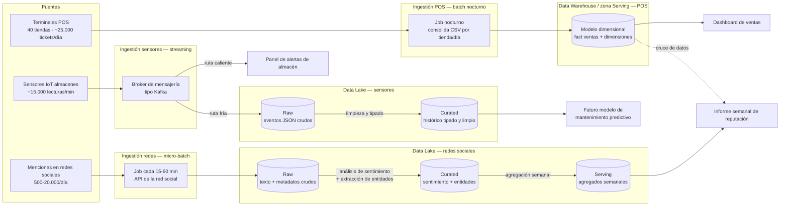

# Laboratorio 2.2 — De CSV a Data Lake: diseña la arquitectura

**Navegación:** [Índice general](../../README.md) · [Índice del módulo](../README.md) · ⟵ [Laboratorio anterior (2.1): Diagnóstico de las 5 Vs en un dataset real](../lab-2.1-diagnostico-5vs/enunciado.md) · [Laboratorio siguiente (2.3): Primeros pasos con PySpark](../lab-2.3-primeros-pasos-pyspark/enunciado.md) ⟶

## Índice

- [Objetivo de aprendizaje](#objetivo-de-aprendizaje)
- [Contexto](#contexto)
- [El caso: RetailCorp](#el-caso-retailcorp)
  - [Fuente 1 — Ventas de punto de venta (POS)](#fuente-1-ventas-de-punto-de-venta-pos)
  - [Fuente 2 — Sensores IoT de los almacenes](#fuente-2-sensores-iot-de-los-almacenes)
  - [Fuente 3 — Menciones en redes sociales](#fuente-3-menciones-en-redes-sociales)
  - [Consumo final esperado](#consumo-final-esperado)
- [Actividades paso a paso](#actividades-paso-a-paso)
  - [1. Lectura y reparto de roles (10 min)](#1-lectura-y-reparto-de-roles-10-min)
  - [2. Decisiones de ingestión y almacenamiento (30 min)](#2-decisiones-de-ingestion-y-almacenamiento-30-min)
  - [3. Dibujar el flujo completo (30 min)](#3-dibujar-el-flujo-completo-30-min)
  - [4. Intercambio y feedback entre grupos (15 min)](#4-intercambio-y-feedback-entre-grupos-15-min)
- [Entregable](#entregable)
- [Preguntas de reflexión](#preguntas-de-reflexion)
- [Solución propuesta](#solucion-propuesta)
  - [Fuente 1 — Ventas POS](#fuente-1-ventas-pos)
  - [Fuente 2 — Sensores IoT de almacenes](#fuente-2-sensores-iot-de-almacenes)
  - [Fuente 3 — Menciones en redes sociales](#fuente-3-menciones-en-redes-sociales-2)
  - [Qué debe reflejar el consumo final](#que-debe-reflejar-el-consumo-final)
  - [Diagrama de referencia](#diagrama-de-referencia)
  - [Errores frecuentes a vigilar al evaluar](#errores-frecuentes-a-vigilar-al-evaluar)

---

> **Bloque temático:** [`03-arquitectura-big-data.md`](../../../02-fundamentos-del-big-data/03-arquitectura-big-data.md)
> **Duración orientativa:** 90 minutos
> **Modalidad:** grupos de 3-4 personas, sin código
> **Herramientas:** Draw.io, Excalidraw, o papel y bolígrafo

## Objetivo de aprendizaje

Aplicar los conceptos de Data Warehouse, Data Lake, Data Lakehouse y las zonas Raw/Curated/Serving al diseño de una arquitectura de datos completa para un caso de negocio con múltiples fuentes heterogéneas.

## Contexto

En el laboratorio 2.1 trabajaste con un único CSV ya extraído y limpio. En el mundo real, ese CSV es el resultado final de un pipeline que empieza en varias fuentes distintas — cada una con su propio volumen, velocidad y formato — y termina en un almacén de datos diseñado para responder las preguntas de negocio que importan. Este laboratorio te pide diseñar ese pipeline completo, desde las fuentes hasta el consumo, para un caso de negocio ficticio: RetailCorp.

No hay una única solución correcta. El objetivo es que el grupo argumente sus decisiones (patrón de ingestión, tipo de almacenamiento, zonificación) apoyándose en los criterios vistos en el bloque de arquitectura: latencia necesaria, volumen, variedad de formatos y coste operativo.

## El caso: RetailCorp

RetailCorp es una cadena ficticia de 40 tiendas físicas de electrónica y hogar, con presencia también en un marketplace online. La dirección quiere centralizar tres fuentes de datos muy distintas entre sí para construir una plataforma de analítica unificada:

### Fuente 1 — Ventas de punto de venta (POS)

- **Qué es:** cada tienda física tiene terminales de punto de venta que registran cada ticket de compra (productos, importe, forma de pago, empleado, hora).
- **Volumen aproximado:** las 40 tiendas generan en conjunto unos 25.000 tickets al día, cada uno con 3-5 líneas de producto de media. Son datos estructurados (equivalentes a filas de una tabla).
- **Frecuencia:** los terminales sincronizan sus datos con el sistema central cada noche, en un batch nocturno (no hay conexión en tiempo real entre tienda y central).
- **Formato:** exports en CSV, uno por tienda y día.

### Fuente 2 — Sensores IoT de los almacenes

- **Qué es:** los 3 almacenes regionales de RetailCorp tienen sensores de temperatura (para productos sensibles) y sensores de ocupación (para optimizar la logística de reposición).
- **Volumen aproximado:** cada almacén tiene unos 150 sensores que emiten una lectura cada 30 segundos. Eso son del orden de 15.000 lecturas por minuto en conjunto, las 24 horas del día.
- **Frecuencia:** flujo continuo, ininterrumpido. Una alerta de temperatura fuera de rango debe poder disparar una notificación en menos de un minuto (riesgo de pérdida de mercancía sensible).
- **Formato:** eventos JSON individuales, publicados por cada sensor a través de un broker de mensajería.

### Fuente 3 — Menciones en redes sociales

- **Qué es:** el departamento de marketing quiere monitorizar menciones de la marca RetailCorp en redes sociales para medir sentimiento y detectar quejas o incidencias virales.
- **Volumen aproximado:** entre 500 y 2.000 menciones diarias en condiciones normales, con picos de hasta 20.000 en un día de campaña o de crisis reputacional.
- **Frecuencia:** los datos se obtienen mediante la API pública de la red social, consultable bajo demanda o mediante suscripción a eventos. La dirección de marketing considera aceptable un retraso de hasta 1 hora en detectar una tendencia — no necesitan reacción en segundos, pero sí antes de que termine el día.
- **Formato:** texto libre (el contenido de la mención) más metadatos estructurados (usuario, fecha, número de interacciones). Es decir, datos semiestructurados.

### Consumo final esperado

- Un **dashboard de ventas** para dirección, actualizado cada mañana con los datos del día anterior.
- Un **panel de alertas de almacén** para el equipo de logística, que debe reaccionar en minutos ante una anomalía de temperatura u ocupación.
- Un **informe semanal de reputación de marca** para marketing, que cruza menciones en redes con picos o caídas de ventas.
- A medio plazo, un **modelo de mantenimiento predictivo** sobre los sensores de los almacenes (fuera del alcance de este laboratorio, pero la arquitectura debe dejar la puerta abierta a entrenarlo sobre datos históricos).

## Actividades paso a paso

### Lectura y reparto de roles (10 min)

Formad grupos de 3-4 personas. Leed el caso completo y aseguraos de que todo el grupo entiende las tres fuentes y los cuatro consumos esperados antes de empezar a dibujar.

### Decisiones de ingestión y almacenamiento (30 min)

Para **cada una de las tres fuentes**, decidid y justificad por escrito:

- **Patrón de ingestión:** ¿batch, streaming, o una combinación? Apoyaos en la tabla de "Batch vs Streaming" del apunte de procesamiento y en los criterios de latencia del bloque de arquitectura.
- **Arquitectura de almacenamiento:** ¿data warehouse, data lake, o data lakehouse? Justificad la elección pensando en la variedad de formato de cada fuente (los datos POS son estructurados, los sensores son semiestructurados/eventos, las redes sociales incluyen texto libre).

No hace falta que las tres fuentes usen la misma arquitectura de almacenamiento si tenéis argumentos sólidos para tratarlas de forma distinta — pero también es una opción legítima centralizarlo todo en una única plataforma (por ejemplo, un lakehouse) si justificáis por qué compensa la simplicidad operativa.

### Dibujar el flujo completo (30 min)

Con las decisiones del paso 2 ya tomadas, dibujad el diagrama de arquitectura end-to-end: desde las tres fuentes hasta los cuatro consumos finales. Usad `plantilla-diagrama.md` como referencia de qué elementos debe incluir el diagrama y qué nivel de detalle se espera (el ejemplo de esa plantilla usa un caso distinto y más simple, solo como referencia de formato — no es la solución de RetailCorp).

Si optáis por un data lake o lakehouse en alguna parte del flujo, marcad explícitamente en el diagrama las zonas **Raw**, **Curated** y **Serving**, e indicad qué transformación ocurre entre cada zona.

### Intercambio y feedback entre grupos (15 min)

Intercambiad vuestro diagrama con otro grupo. Dedicad 2 minutos a revisar el diagrama recibido y anotad: una decisión que os parezca bien justificada, y una pregunta o duda que le haríais al grupo autor. Devolved el diagrama con esas anotaciones.

## Entregable

Un diagrama de arquitectura (Draw.io, Excalidraw, foto de un dibujo en papel, o similar) que cubra las tres fuentes, el patrón de ingestión elegido para cada una, el tipo de almacenamiento (con zonas Raw/Curated/Serving si aplica) y los cuatro consumos finales — acompañado de la justificación escrita de cada decisión (puede ir en el propio diagrama como anotaciones, o en un documento aparte).

## Preguntas de reflexión

- ¿Qué fuente os ha resultado más difícil de encajar en un único patrón de ingestión (batch o streaming) y por qué?
- Si RetailCorp decidiera fusionar las tres fuentes en una única plataforma de lakehouse, ¿qué complejidad estaríais ganando en simplicidad y qué complejidad estaríais perdiendo en flexibilidad?

## Solución propuesta

*Intenta resolver primero la actividad por tu cuenta. Lo que sigue es la solución de referencia, útil para autocorregirte.*

No hay una única solución correcta para RetailCorp — esta es la propuesta de referencia, razonada con los mismos criterios (latencia, volumen, variedad de formato, coste operativo) que se pide aplicar en el laboratorio. Una respuesta distinta y bien argumentada es igual de válida.

### Fuente 1 — Ventas POS

- **Ingestión: batch.** Los propios terminales ya sincronizan una vez al noche; no hay ninguna necesidad de negocio ni infraestructura que justifique streaming. El dashboard de ventas se consume por la mañana con los datos del día anterior — encaja con una ventana de latencia de horas.
- **Almacenamiento: data warehouse, o la zona Curated/Serving de un lakehouse.** Los datos son estructurados desde origen (CSV con esquema fijo) y el caso de uso es analítico clásico (agregaciones, series temporales de ventas), que se beneficia de un modelo dimensional (fact de ventas + dimensiones de tienda, producto, fecha). Cargar esto directamente en la zona Raw de un data lake sin más procesamiento también es defendible, siempre que se explique cómo se llega después a un modelo consultable para el dashboard.

### Fuente 2 — Sensores IoT de almacenes

- **Ingestión: streaming.** La necesidad de alertar en menos de un minuto ante una anomalía de temperatura descarta cualquier patrón batch o micro-batch de varios minutos. Requiere un broker de mensajería (tipo Kafka o equivalente cloud) con procesamiento continuo (Structured Streaming o similar) para las alertas en caliente.
- **Almacenamiento: data lake (zonas Raw/Curated).** El volumen es alto (miles de eventos por minuto) y el formato es semiestructurado (JSON). Hay en realidad **dos rutas de consumo del mismo stream**: una ruta "caliente" directa a las alertas (no necesita pasar por el lake) y una ruta "fría" hacia el lake, en Raw primero y Curated después de tipar y limpiar, para el histórico y el futuro modelo de mantenimiento predictivo. Esta distinción entre ruta caliente y fría (una arquitectura Lambda/Kappa simplificada) es un punto de calidad a valorar positivamente si un grupo la propone espontáneamente.

### Fuente 3 — Menciones en redes sociales

- **Ingestión: batch o micro-batch, no streaming estricto.** La propia dirección de marketing acepta hasta 1 hora de retraso — es una pista explícita del enunciado para no caer en streaming "porque suena a redes sociales en tiempo real". Un job que consulta la API cada 15-60 minutos es suficiente y mucho más barato operativamente.
- **Almacenamiento: data lake.** El contenido es semiestructurado/no estructurado (texto libre + metadatos), lo que encaja mal en un warehouse relacional sin procesar antes el texto. Zona Raw para el texto crudo, Curated tras aplicar el modelo de sentimiento y extraer campos estructurados (sentimiento, entidades mencionadas), Serving para las agregaciones que alimentan el informe semanal. Los picos de hasta 20.000 menciones/día en crisis reputacional son un buen argumento para almacenamiento elástico (object storage cloud) frente a infraestructura fija dimensionada para el caso medio.

### Qué debe reflejar el consumo final

- El **dashboard de ventas** se alimenta de la ruta batch de POS, vía warehouse o zona Serving.
- El **panel de alertas de almacén** se alimenta directamente del stream de sensores (ruta caliente), sin pasar necesariamente por el lake.
- El **informe de reputación de marca** cruza datos de dos fuentes distintas (redes sociales + ventas) — el valor de centralizar datos está precisamente en poder cruzar fuentes que antes vivían separadas.
- El **mantenimiento predictivo** (fuera de alcance de este laboratorio) es consumidor de la zona Curated/histórico del lake de sensores, no de la ruta de alertas en caliente.

### Diagrama de referencia

### Errores frecuentes a vigilar al evaluar

- Proponer streaming para las tres fuentes "porque es lo más moderno", ignorando las pistas de latencia que da el propio enunciado.
- No distinguir las zonas Raw/Curated/Serving y meter todo en una única "base de datos" sin explicar transformaciones.
- Olvidar conectar alguno de los cuatro consumos finales en el diagrama.
- No justificar por escrito las decisiones — un diagrama correcto sin razonamiento no demuestra que el grupo entiende los criterios.

---

**Navegación:** [Índice general](../../README.md) · [Índice del módulo](../README.md) · ⟵ [Laboratorio anterior (2.1): Diagnóstico de las 5 Vs en un dataset real](../lab-2.1-diagnostico-5vs/enunciado.md) · [Laboratorio siguiente (2.3): Primeros pasos con PySpark](../lab-2.3-primeros-pasos-pyspark/enunciado.md) ⟶
