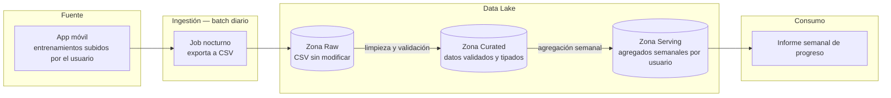

# Plantilla de diagrama — Laboratorio 2.2

Esta plantilla te da dos cosas: un **ejemplo de notación y nivel de detalle** (con un caso distinto y mucho más simple que RetailCorp, solo a modo de referencia de formato) y una **checklist** de los elementos que tu diagrama final de RetailCorp debe incluir.

## Ejemplo de notación (caso distinto, solo de referencia)

Imagina una pequeña app de fitness que registra los entrenamientos que sus usuarios suben manualmente desde el móvil, y quiere generar un informe semanal de progreso por usuario. Un diagrama con el nivel de detalle esperado para ese caso (mucho más simple que RetailCorp) sería:

Fíjate en lo que este ejemplo sí incluye, y que tu diagrama de RetailCorp también debe incluir:

- La fuente identificada de forma explícita (no un genérico "datos").
- El patrón de ingestión nombrado (aquí, batch diario) y qué lo dispara.
- Las zonas del data lake diferenciadas, con una etiqueta breve de qué transformación ocurre entre cada una.
- El consumo final conectado al final del flujo, no flotando sin conexión.

Tu caso (RetailCorp) tiene **tres fuentes** con patrones de ingestión distintos y **cuatro consumos finales**, así que tu diagrama será más grande y probablemente tenga más de una rama de almacenamiento — el ejemplo de arriba es deliberadamente el caso más simple posible, no una plantilla a copiar literalmente.

## Checklist del diagrama final (RetailCorp)

Antes de dar por terminado el diagrama, comprueba que incluye:

- [ ] Las **tres fuentes** identificadas por separado (POS, sensores IoT, redes sociales).
- [ ] El **patrón de ingestión** de cada fuente (batch, streaming, o ambos), nombrado explícitamente en el diagrama.
- [ ] El **tipo de almacenamiento** elegido para cada fuente o para el conjunto (data warehouse, data lake o data lakehouse), con una etiqueta o nota que justifique la elección.
- [ ] Si hay data lake o lakehouse en el flujo: las zonas **Raw**, **Curated** y **Serving** marcadas de forma diferenciada, con una breve descripción de qué ocurre en la transición entre zonas.
- [ ] Los **cuatro consumos finales** conectados al final del flujo: dashboard de ventas, panel de alertas de almacén, informe de reputación de marca, y un punto de acceso para el futuro modelo de mantenimiento predictivo.
- [ ] Una nota o leyenda que indique, para cada decisión de arquitectura tomada, **el criterio que la justifica** (latencia requerida, volumen, variedad de formato, coste operativo).

## Notación sugerida

No es obligatorio usar Mermaid — Draw.io, Excalidraw o un dibujo en papel son igual de válidos. Si usáis formas, mantened una convención consistente durante todo el diagrama, por ejemplo:

- Rectángulos → fuentes o sistemas.
- Cilindros → almacenamiento (bases de datos, lake, warehouse).
- Flechas etiquetadas → flujo de datos, con el patrón de ingestión o transformación indicado sobre la flecha.
- Óvalos o nubes → consumo final (dashboards, informes, modelos).
